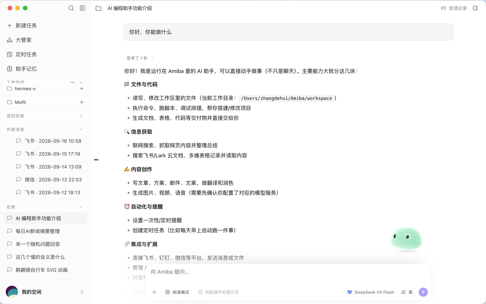
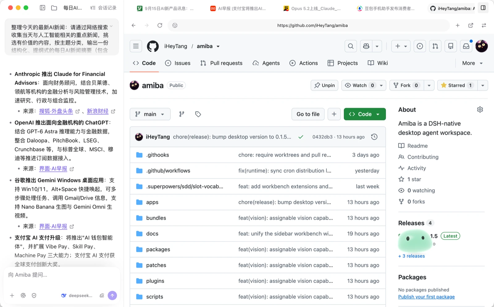
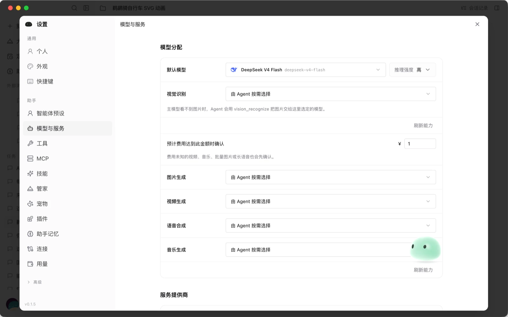
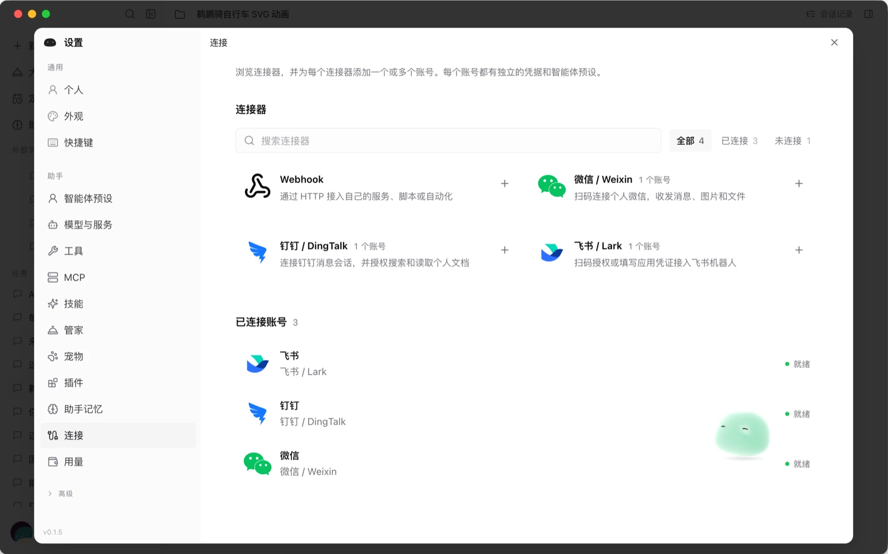
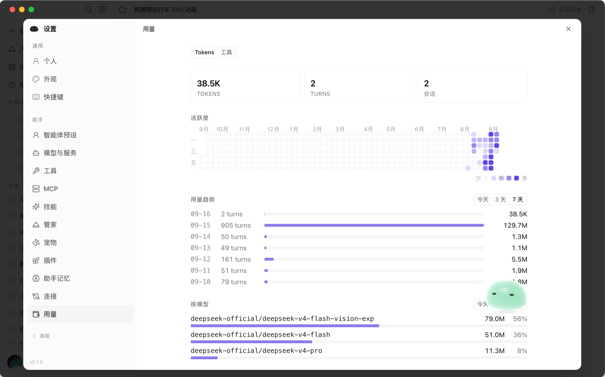

# Amiba

[DSH slot compatibility ledger](DSH-SLOT-COMPATIBILITY.md) — maintained release comparison, Amiba support, and adoption/retirement decisions (Chinese).

**A DSH-native desktop agent workspace.** · [中文文档](./README.zh-CN.md)

Amiba is a desktop agent workspace built on top of
[DeepSeek Harness](https://github.com/deepseek-ai/deepseek-harness) (DSH). DSH remains
the **single source of truth** for the agent runtime — sessions, the event stream,
context assembly, models, presets, tools, approvals, questions, skills, MCP clients,
and schedules. Amiba adds a desktop application, a narrow native OS bridge, and a set
of product capabilities that need agent-lifecycle access, each implemented as a Cordis
plugin *inside* DSH.

This repository intentionally has one runtime path. There is no compatibility gateway,
Python sidecar, browser-extension runtime, transcript fallback, or dual-write migration
layer.

## Screenshots

<p align="center">
  
</p>
<p align="center"><em>A chat-driven workspace: workspaces, scheduled tasks, external messages and task history on the left; the conversation in the center.</em></p>

|  |  |
|:---:|:---:|
|  |  |
| *Embedded browser + live web research* | *Model assignment & capability routing* |
|  |  |
| *Connectors: Lark, DingTalk, WeChat, Webhook* | *Usage: tokens, activity heatmap, per-model* |

## What Amiba adds on top of DSH

Amiba is **not** a fork of DSH's core — the agent runtime is used as-is. The difference
is everything around it, shipped as independent `dsh-plugin-*` projects.

| Layer | Official DSH | Amiba (this repo) |
| --- | --- | --- |
| Agent runtime | Owns sessions, events, context, tools, skills, MCP, schedules, approvals | Consumed unchanged |
| Surfaces | Web Shell, CLI | **+ a native desktop app** (Electron): windows, notifications, filesystem, PTY terminals, visible embedded browser, screen capture, external inbox, workspace checkpoints |
| Models & credentials | Presets + execution | **+ Model Plane**: provider/model discovery, credentials, capability routing (default + reasoning, vision, image/video/speech/music generation), cost-confirmation gates |
| Integrations | MCP, web tools | **+ first-class connectors**: Lark, DingTalk, WeChat, Webhook, with an external inbox and persisted sessions |
| Memory | Per-session context | **+ cross-session long-term memory** (memos) |
| Observability | — | **+ usage analytics**: token/turn counts, activity heatmap, per-model breakdown |
| Assistant abilities | — | **+ vision** (assignable for text-only agents), **media generation** routing, **scheduled tasks**, **desktop pet** |
| UI | Official Web Shell slots | **+ a full desktop UI** (`@amiba/ui` + `dsh-plugin-ui-shell`) that adopts official slots but ships its own pixels |
| Authoring | Host/Client plugin API | **+ Extension SDK** (`@amiba/extension-sdk`) and `amiba plugin create` |

Every Amiba capability is an independent, versioned Cordis plugin; the bundles only
compose them. The ownership map is documented in
[`docs/2026-08-15-dsh-native-architecture.md`](docs/2026-08-15-dsh-native-architecture.md).

## Architecture

Core and plugin data upgrade conventions: [data-upgrades.md](docs/data-upgrades.md) (design only; no pre-release legacy migrations).

```text
React UI
   │ typed PlatformAdapter / ChatEngineClient
Electron main
   ├─ managed DSH process ── official DSH HTTP + WebSocket APIs
   │     ├─ native sessions, tools, models, presets, skills, MCP, schedules
   │     └─ @amiba/dsh-bundle-amiba (composition only)
   │           ├─ @amiba/dsh-plugin-model-plane (canonical plane + DSH projection)
   │           ├─ @amiba/dsh-plugin-memory-memos
   │           ├─ @amiba/dsh-plugin-messaging-core
   │           ├─ @amiba/dsh-plugin-connector-webhook
   │           ├─ @amiba/dsh-plugin-attachments
   │           ├─ @amiba/dsh-plugin-mcp-manager
   │           ├─ @amiba/dsh-plugin-runtime-inventory
   │           ├─ @amiba/dsh-plugin-browser-core
   │           ├─ @amiba/dsh-plugin-browser-provider-cdp
   │           ├─ @amiba/dsh-plugin-browser-provider-electron
   │           └─ other independent dsh-plugin-* packages
   ├─ authenticated native operation gateway (no plugin/tool registry)
   ├─ process-wide DSH telemetry
   └─ filesystem, windows, notifications, native-image staging, visible browser,
      terminals, external inbox, screen capture, and workspace checkpoints
```

The detailed ownership model, capability decisions, memory design, security
boundaries, and rollout plan are documented in
[`docs/2026-08-15-dsh-native-architecture.md`](docs/2026-08-15-dsh-native-architecture.md).
The physical application-runtime consolidation is audited in
[`docs/2026-08-15-app-runtime-consolidation.md`](docs/2026-08-15-app-runtime-consolidation.md).

## Workspace

- `apps/desktop`: Electron interaction layer consuming the shared app runtime.
- `apps/cli`: task, Web, and DSH plugin-development CLI using that same runtime.
- `packages/app-runtime`: shared domain types, platform contracts, protocol,
  DSH client, DSH distribution composition, pinned Node/DSH runtime, and the
  harness-independent Model Plane domain module. Its `dsh-runtime` submodule
  owns preparation, verification, profile paths, and integration smoke checks.
  Durable ownership and DSH projection live in `dsh-plugin-model-plane`.
- `plugins/dsh-plugin-*`: independently versioned Cordis plugin projects. Each
  functional module owns its DSH services/tools and declares inter-plugin
  dependencies explicitly.
- `bundles/dsh-bundle-amiba-*`: ordering and configuration only; these compose the
  independent plugins into the Amiba DSH profile.
- `packages/ui`: the existing Amiba interface, adapted to DSH contracts.
- `packages/extension-sdk`: public Amiba contracts for DSH plugin authors.

## Managed runtime

CLI, Web, and Electron do not discover a system DSH or use system Node to run
DSH. Their shared runtime is pinned to:

- DSH `0.1.5-rc.1`
- Node.js `22.22.0`
- Amiba plugin revision `2026-08-16.2`
- plugin-installer pnpm `9.12.0` (bundled with the managed runtime)

The exact values live in
[`packages/app-runtime/dsh-runtime-manifest.json`](packages/app-runtime/dsh-runtime-manifest.json).
The prepared runtime under `packages/app-runtime/resources/dsh-runtime/`
is generated and ignored by Git. Desktop packaging copies that shared artifact
into the application instead of owning a second runtime.

The Plugins settings page reads the official DSH Loader inventory and can
install npm packages or CLI-produced `dsh-plugin.tgz` archives. Install,
update, and removal delegate to `dsh plugin --profile web`; Amiba then restarts
and reads the newly composed Host/Client graph. Electron keeps no second
plugin registry.

For browser execution in CLI/Web, start Chrome or Chromium with remote
debugging and set `AMIBA_BROWSER_CDP_URL=http://127.0.0.1:9222`. With no
endpoint, the CDP provider registers nothing and browser tools are absent from
that runtime's effective catalog. Electron automatically registers the
higher-priority visible-browser provider.

## Development

Requirements: Node.js `^22.19.0` or `>=24.0.0`, pnpm 9, and macOS for the
fresh-profile harness.

```bash
pnpm install
pnpm runtime:prepare
pnpm dev:desktop
```

`pnpm dev:desktop` verifies/prepares the managed runtime, then starts a lightweight
source watcher and Electron. It reuses verified Client bundles instead of rebuilding
all of them again before opening the window. The first preparation, or a changed
runtime source digest, still runs the normal runtime build/install path.

Development previews can run alongside the installed release. Electron uses a
separate persistent user-data directory (the normal directory with `-dev` appended;
on macOS, `~/Library/Application Support/@amiba/desktop-dev`). Preview settings,
credentials, conversations, runtime profiles, and the single-instance lock are
isolated from the release. Configure providers once in the preview; its data is
retained across restarts. `AMIBA_USER_DATA_DIR` still overrides this location,
including for the fresh-profile commands.

Global shortcuts and `amiba://` registration stay with the installed release by
default. To test those OS integrations in the preview, quit the release and launch
with `AMIBA_DEV_OS_INTEGRATION=1 pnpm dev:desktop`.

Saving UI or plugin source queues only affected Client bundles. Compiler-recorded
inputs include tree-shaken modules; older bundles fall back to workspace dependency
tracking. A short debounce coalesces saves, and one short-lived compiler runs at a
time so Rollup/PostCSS caches do not accumulate across all plugins. Development
rebuilds skip minification, retain sourcemaps, and publish the existing CJS factory
last through an atomic rename. Failed builds leave the last working bundle intact.
DSH's existing rebuild channel refreshes the window; host-plugin, dependency-manifest,
and Cordis-patch changes still require a dev process restart.

Plugins that already inject UI Shell share `@amiba/ui/plugin` through that existing
module identity. Source imports and the DSH factory/injection protocol are unchanged.
The build-only `.client-inputs.json` is not a runtime API.
Every emitted external request must also be declared in `dsh.client.external`;
`dsh.client.inject` only controls service injection, not module arrival. The build
fails on declaration drift, and the client verifier exercises cold consumer-first
and concurrent imports with the installed DSH browser module loader.

Useful verification commands:

```bash
node --test apps/desktop/scripts/dsh-client-externals.test.mjs apps/desktop/scripts/dsh-module-arrival.test.mjs apps/desktop/scripts/dsh-client-dependencies.test.mjs apps/desktop/scripts/watch-dsh-clients.test.mjs
node apps/desktop/scripts/verify-dsh-clients.mjs
pnpm runtime:verify
pnpm runtime:smoke
pnpm -r typecheck
pnpm -r --if-present test
pnpm build:desktop
```

Run a fully isolated first-launch profile with:

```bash
pnpm dev:desktop:fresh
pnpm dev:desktop:fresh:keep
```

## Deliberate cuts

The migration removes features whose lifecycle could not be made DSH-native:
the Python service plane, standalone browser extension target, voice/STT,
Kanban/task-center projection, virtual-model orchestration, old runtime plugin
management, legacy transcript import/rewind, and first-class MCP
resources/prompts. New agent-facing capabilities must be implemented as their
own `dsh-plugin-*` projects. OS execution remains behind narrow, testable
platform operations; it does not own or publish DSH tool definitions.
