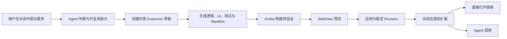
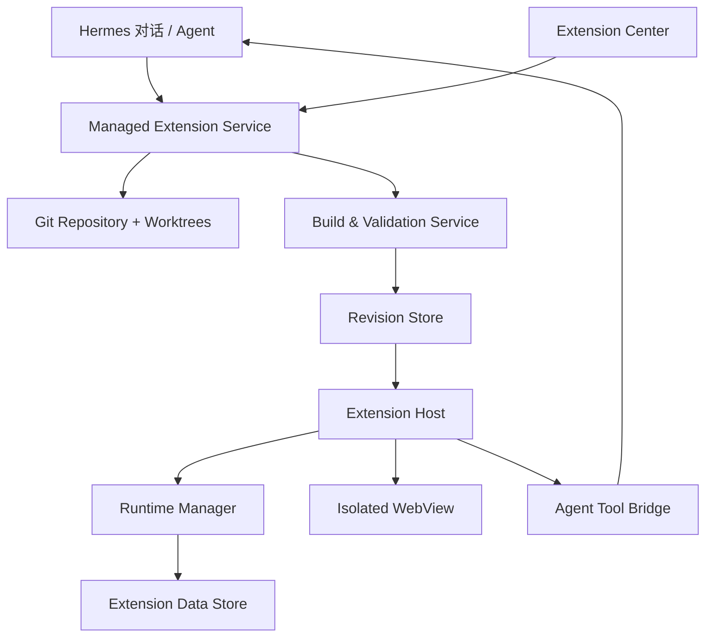
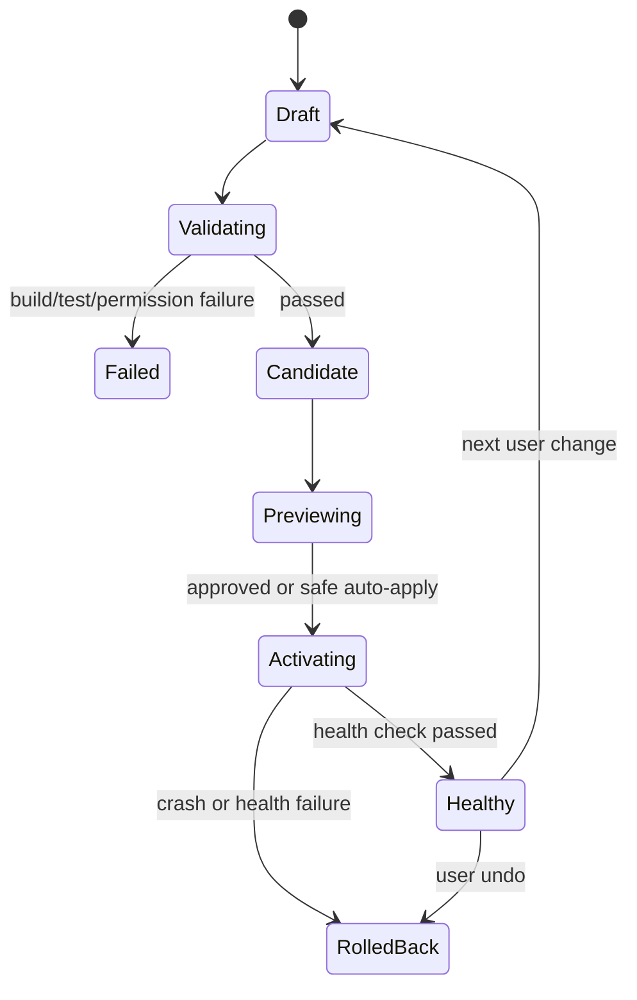

# Amiba 托管个人扩展设计方案

> 日期：2026-08-06  
> 状态：设计提案  
> 范围：Amiba Desktop、Extension Host、Extension API、CLI、Hermes 集成

## 1. 摘要

Amiba 需要让普通用户把一次对话中形成的脚本、计算逻辑或工作流，沉淀为可以长期使用的 Extension。用户不需要理解源码、Git、构建、依赖、版本号或进程管理；Amiba 负责创建、预览、安装、升级、健康检查、回滚、数据迁移和导出。

本方案不引入独立的 Applet 包格式。对外只有一种产物：**Extension**。

- 专业开发者通过外部项目开发 Extension，Amiba 以开发链接方式加载，核心用途是调试。
- 普通用户通过对话创建 Extension，项目、Git、构建、Revision 和 Runtime 全部由 Amiba 托管。
- Marketplace Extension、个人托管 Extension 和开发者 Extension 使用同一套 Manifest、Extension API、WebView 和运行协议。
- “小工具”或“我的工具”可以作为普通用户的产品文案，但不成为新的技术类型。

核心设计原则：

1. **一种 Extension 格式，多种来源与生命周期。**
2. **托管意味着 Amiba 对源码、运行产物、依赖、数据和恢复能力负责。**
3. **Git 管理源码演进；Revision 管理实际可运行状态。**
4. **WebView 是统一 UI 运行时；托管 UI 固定为 React + TypeScript + Amiba UI SDK。**
5. **后端协议与语言无关；Runtime 必须由 Amiba 正式支持和管理。**
6. **Agent 只能修改草稿工作区，不能直接修改当前运行版本。**
7. **普通用户看到自然语言修改记录和“撤销”，而不是 Git、SemVer 和部署流程。**

---

## 2. 背景与问题

目前 Agent 可以临时生成脚本并运行，例如根据用户输入计算房贷。一次性计算没有问题，但当逻辑值得复用时，会遇到以下缺口：

- 脚本跟随对话或临时工作区存在，无法作为稳定产物长期复用。
- 用户没有统一入口浏览、启动和维护自己产生的工具。
- 工具无法同时服务“Agent 调用”和“用户直接操作界面”两个入口。
- 普通用户不希望理解代码仓库、依赖安装、构建失败、版本冲突或回滚。
- 现有本地 Extension 流程面向专业开发者：注册外部目录、热重载，Amiba 不拥有项目生命周期。

目标不是建立一个低配脚本容器，而是让用户通过 Agent 持续“武装自己的 Amiba”：

> 用户在对话中表达需求，Amiba 将需求变成一个标准 Extension；此后用户既可以直接打开使用，也可以让 Agent 调用，并继续通过自然语言修改它。

---

## 3. 目标与非目标

### 3.1 目标

- 从对话创建完整 Extension，包括业务逻辑、UI、Agent Tool 和测试。
- 为个人 Extension 提供 Amiba 托管的源码、Git、构建和运行环境。
- 支持稳定预览、原子升级、自动健康检查和一键撤销。
- 提供统一的 Extension Center，浏览个人扩展、已安装扩展和 Marketplace。
- 让同一个 Extension 同时支持 Web UI 直接使用和 Hermes Agent 调用。
- 保留完整标准 Extension 能力，使个人 Extension 可以导出、继续专业开发或发布。
- 在 Manifest 和运行协议层为 Web-only、Node、Python 和混合后端预留一致模型。

### 3.2 非目标

- 不为普通用户暴露 Git 分支、Commit Hash、依赖安装或 SemVer 操作。
- 不允许 Agent 直接修改正在运行的 Extension 目录。
- 不在第一阶段支持任意语言或任意本机可执行文件。
- 不在第一阶段支持悬浮窗、聊天内嵌组件、菜单栏窗口等大量 UI Surface。
- 不把 Git 当作构建产物、权限、用户数据和运行健康状态的唯一数据库。
- 不为托管 Extension 引入第二套 Manifest 或第二套 UI 运行时。

---

## 4. 统一概念模型

### 4.1 Extension 是唯一产物类型

“Applet”描述的是一个普通用户场景，不描述一种包格式：

```text
Extension
├── Marketplace Extension
├── Personal Managed Extension   # 普通用户通过对话创建
├── Developer Linked Extension   # 专业开发者调试
└── Bundled Extension
```

所有类型都可以使用：

- `manifest.json`
- Extension Main / Backend
- Web UI Bundle
- `window.amiba` Bridge
- `contributes.main`、`contributes.settings`
- Agent Tool contribution
- Extension 权限模型

### 4.2 来源与管理方式

Extension 的包内容不记录“我是普通用户创建的”。来源和管理方式属于安装记录：

```ts
type ExtensionSource =
  | "bundled"
  | "marketplace"
  | "personal-managed"
  | "developer-linked";

type ExtensionInstallMode =
  | "managed"
  | "linked";
```

| 来源 | 所有者 | 加载方式 | Amiba 是否管理源码 | 主要用途 |
|---|---|---|---|---|
| bundled | Amiba | managed | 否 | 内置能力 |
| marketplace | 发布者 / Amiba 安装 | managed | 否 | 使用第三方扩展 |
| personal-managed | Amiba / 用户 | managed | 是 | 对话创建、长期使用 |
| developer-linked | 外部开发者 | linked | 否 | 开发调试 |

### 4.3 两种本地模式不能混淆

#### Developer Linked Extension

- 项目位于开发者选择的外部目录。
- Amiba 注册目录路径，不复制、不接管源码。
- 开发者使用 Hermes、IDE 或其他 Coding Agent 编程。
- Amiba 提供加载、热重载、日志和调试能力。
- 解除链接只删除注册记录，永远不删除外部项目。
- 项目损坏、依赖缺失和 Git 状态由开发者负责。

#### Personal Managed Extension

- 项目位于 Amiba 的用户数据目录。
- 普通用户通过对话创建和修改，不需要看到源码。
- Amiba 管理 Git 仓库、工作区、依赖、构建、Revision、运行和数据。
- Agent 只能在 Amiba 发放的草稿 worktree 中工作。
- 当前稳定运行版本是不可变构建产物，不等于源码目录。
- 删除、恢复、导出和发布均通过 Amiba 生命周期 API 完成。

---

## 5. 用户体验与信息架构

### 5.1 目标用户

核心用户不是正在写代码的人，而是刚刚在对话中解决了一个重复问题、希望下次直接使用的人。例如：

- 刚刚让 Agent 算完一次房贷，希望保留成计算器。
- 经常将同一类 CSV 转换成固定格式。
- 希望沉淀一个报价、排班、报表或内容处理工作流。
- 需要继续改进工具，但不想理解工程结构。

用户需要完成的动词是：**创建、使用、改进、撤销、分享**，而不是 clone、build、merge、deploy。

### 5.2 Extension Center

新增第一方 Extension Center，作为统一浏览和管理入口：

```text
扩展
├── 我的扩展      # personal-managed
├── 已安装        # bundled + marketplace + personal-managed
├── 扩展市场      # marketplace
└── 开发者模式    # developer-linked，默认折叠或需开启
```

“我的扩展”提供：

- 搜索、最近使用、收藏和标签。
- 打开使用、固定到侧边栏。
- “通过对话修改”。
- 自然语言修改记录。
- 撤销最近修改、恢复历史状态。
- 查看权限和数据占用。
- 导出项目、导出安装包、发布。
- 删除与恢复。

Extension 多时不应全部自动占据侧边栏。安装后的 `contributes.main` 表示“可以作为主页面打开”，是否固定到侧边栏由用户决定。为兼容现有行为，可将当前已安装 Extension 在迁移时默认设为已固定。

### 5.3 产品视觉方向

Extension Center 是反复使用的工作界面，不是以营销卡片为中心的应用商店。

- **领域词汇**：工具架、工作台、草稿、已应用、修改记录、恢复点、权限、能力。
- **视觉基调**：延续 Amiba 的中性底色和单一交互强调色；颜色只表达运行、警告、失败、权限变化等状态。
- **标志性元素**：每个托管 Extension 都有一条“从对话到能力”的自然语言时间线，能回到创建或修改它的会话。
- **拒绝默认方案**：
  - 通用 Marketplace 卡片瀑布流 → 以可扫描的工具列表和详情面板为主。
  - 面向开发者的版本与构建控制台 → 以“已更新 / 可以撤销”表达生命周期。
  - 每个工具自行绘制导航和标题 → 宿主统一提供位置、标题和权限状态。

界面强调温和可接近与精确反馈：普通用户可以放心使用，开发信息只在需要诊断时逐层展开。

### 5.4 创建流程



用户可以显式说“把它做成一个工具”，也可以由 Agent 在一次成功的重复性任务后建议保存。Agent 不应自动把所有临时脚本写入个人扩展库。

### 5.5 修改流程

用户说：

> 给我的房贷计算器增加等额本金和提前还款。

Amiba 执行：

1. 定位托管 Extension 和当前健康 Revision。
2. 从稳定源码 Commit 创建隔离草稿 branch + worktree。
3. Agent 在 worktree 中修改代码和测试。
4. Amiba 构建、测试、校验 Manifest、比较权限。
5. 生成候选 Revision 并预览。
6. 安全变更可以自动应用；高风险变更要求确认。
7. 原子切换运行 Revision，并执行健康检查。
8. 失败则自动恢复；成功则显示“已更新，可以撤销”。

---

## 6. 总体架构



### 6.1 组件职责

#### Managed Extension Service

- 创建、读取、修改和删除托管项目。
- 发放和回收草稿 worktree。
- 协调 Agent authoring、构建、预览、应用和回滚。
- 管理 Revision 状态机和当前指针。
- 生成用户可读的修改摘要。

#### Build & Validation Service

- 使用 Amiba 固定工具链安装或解析依赖。
- 编译 UI、Node Backend 和可选 Worker。
- 执行类型检查、单元测试和契约测试。
- 校验 Manifest、权限、API Version 和平台兼容性。
- 产出不可变、带 Hash 的运行 Artifact。

#### Runtime Manager

- 管理 Node、Python 等受支持 Runtime。
- 启动、停止、取消、超时、日志、心跳和崩溃恢复。
- 建立 Runtime 间受控 RPC。
- 将 Runtime、依赖环境与 Revision 绑定。

#### Extension Host

- 延续现有 Manifest discovery、Runner、WebView 和 UI contribution。
- 根据 Registry 的当前 Revision 加载 Artifact。
- 执行权限校验和 Bridge 路由。
- 向 Hermes 暴露 Extension Agent Tools。

---

## 7. 文件与存储模型

每个 Personal Managed Extension 使用独立 Git 仓库：

```text
<userData>/personal-extensions/<extension-id>/
├── repo.git/                       # Amiba 管理的 bare Git repository
├── worktrees/
│   └── <draft-id>/                 # Agent 临时工作区
├── artifacts/
│   └── <revision-id>/
│       ├── manifest.json
│       ├── dist/
│       ├── runtime-lock.json
│       └── artifact.json
├── revisions/
│   └── <revision-id>.json
├── data/                           # 当前用户数据，不进入 Git
├── data-backups/                   # 迁移和高风险更新前的备份
└── state.json                      # 当前 Revision、草稿和恢复状态
```

设计约束：

- `repo.git` 只保存源码、测试、Manifest、依赖锁文件和必要资源。
- `node_modules`、Python 环境、构建缓存、运行数据和密钥不进入 Git。
- `artifacts/<revision-id>` 不可变，保存真正运行的 Bundle。
- Registry 指向当前 Artifact，而不是草稿源码。
- 更新当前 Artifact 指针必须使用临时文件 + rename 等原子操作。

---

## 8. Git 与 Revision

### 8.1 Git 的职责

| Git 能力 | 用途 |
|---|---|
| commit | 一次候选或成功的源码修改 |
| diff | 生成变更摘要、审查权限相关代码 |
| branch | 隔离未完成修改 |
| worktree | 为每个 Agent 任务提供独立目录 |
| revert | 生成撤销某次源码修改的新候选 |
| merge | 合并明确允许的并行修改 |
| tag | 正式导出和 Marketplace Release |

普通用户不看到 Branch、Commit 或冲突。Amiba 不应依赖用户已经安装系统 Git，应随应用提供可控的 Git 能力。

### 8.2 Revision 的职责

Git Commit 只说明源码状态，不代表可运行。Revision 记录“已验证并可以运行的完整状态”：

```ts
interface ManagedExtensionRevision {
  id: string;
  extensionId: string;
  parentRevisionId?: string;

  sourceCommit: string;
  sourceSessionId?: string;
  userRequest?: string;
  changeSummary: string;

  artifactHash: string;
  manifestHash: string;
  runtimeLockHash: string;

  permissions: string[];
  dataSchemaVersion: number;

  status:
    | "candidate"
    | "activating"
    | "healthy"
    | "failed"
    | "rolled-back";

  createdAt: string;
  activatedAt?: string;
}
```

### 8.3 Branch 与 Tag 策略

- 稳定源码使用内部 ref，例如 `refs/amiba/stable`。
- 每次修改使用 `amiba/draft/<draft-id>` 和独立 worktree。
- 构建失败的 Commit 不进入稳定 ref。
- 内部 Revision 直接引用 Commit Hash，不为每次修改创建 Tag。
- Tag 只用于明确的导出、用户命名恢复点或 Marketplace SemVer Release。
- 同一 Extension 默认串行修改；并行草稿需要显式合并或选择，避免普通用户面对冲突。

### 8.4 应用与回滚



回滚必须恢复：

- 源码基准 Commit。
- 实际运行 Artifact。
- Manifest 和权限集合。
- Runtime 与依赖环境。
- 与该 Revision 对应的数据 Schema 或数据备份。

禁止仅使用 `git reset` 作为产品回滚。

---

## 9. Extension UI 规范

### 9.1 统一运行时

所有 Extension UI 使用本地静态 Web Bundle，并在隔离 Electron WebView 中运行：

```text
manifest.json
dist/ui/main/index.html
dist/ui/assets/*
```

这是桌面内的本地 Web 应用，不是需要部署的远程网站。

### 9.2 两种创作约束

| 项目 | Personal Managed | Developer Linked / Marketplace Author |
|---|---|---|
| UI Runtime | WebView | WebView |
| 默认源码 | React + TypeScript | 任意 Web Framework |
| UI 组件 | Amiba UI SDK | 推荐使用 SDK |
| 构建 | Amiba 固定工具链 | 作者自定义 |
| 依赖 | 锁定、受控 | 作者负责，发布时需自包含 |
| 输出 | 静态 HTML/CSS/JS | 静态 HTML/CSS/JS |

托管项目固定技术栈可以减少 Agent 生成差异、依赖漂移和长期维护成本。Extension Host 不感知源码框架，只验证最终 Bundle 和 API 契约。

### 9.3 UI Surface

MVP 只支持：

- `main`：主要使用页面。
- `settings`：可选的长期配置页面。

后续再评估 `dialog`、`inline`、`widget` 等 Surface。第一阶段不允许 Extension 自行绘制宿主侧边栏、窗口标题栏或全局导航。

### 9.4 Amiba UI SDK

SDK 至少提供：

- FormField、TextInput、NumberInput、Select、DatePicker。
- Button、IconButton、Tabs、Dialog、Popover。
- ResultPanel、Statistic、Table、List、Chart。
- Loading、Empty、Error、Permission 和 Offline 状态。
- Theme、Language、Spacing、Typography 和语义色 Token。
- Calculator、Converter、List/Detail、Tracker、Dashboard、Wizard 模板。

模板是生成起点，不是限制 UI 表达的 JSON DSL。Agent 可以写完整 React，但应优先组合稳定 SDK 组件。

### 9.5 宿主与 Extension 的边界

Amiba 负责：

- 全局导航、Extension 标题和图标。
- 固定、收藏、权限和运行状态。
- 主题、语言和无障碍基础。
- WebView 生命周期、崩溃恢复和错误外壳。

Extension 负责：

- 业务输入和结果呈现。
- Extension 内部局部导航。
- 操作加载、验证、空状态和业务错误。

### 9.6 WebView 安全基线

- `nodeIntegration=false`
- `contextIsolation=true`
- `allowpopups=false`
- 默认拒绝任意网络请求和跨 Extension 访问。
- CSP 禁止 `eval`、任意内联脚本和未声明远程资源。
- 外部链接只能通过 `window.amiba.shell.openExternal`。
- 每个 Extension 使用独立 session partition，隔离 Cookie、Cache 和 Web Storage。
- 主机能力必须通过 `window.amiba`，并按 Manifest 权限校验。

当前所有 WebView 共用 `persist:amiba-extensions` partition，托管模型落地时应调整为每 Extension 隔离。

---

## 10. 后端 Runtime 设计

### 10.1 原则

后端实现可以使用不同语言，但不能让每个 Extension 自己发明安装、启动和通信方式。

> 协议语言无关；Runtime 支持必须显式、受控、可复现。

### 10.2 支持形态

#### Web-only

- 无后台进程。
- 适合房贷计算、转换器和纯前端数据处理。
- 部署最简单，权限面最小。

#### Node Backend

- TypeScript/JavaScript 编译为 Main Bundle。
- 适合文件、网络、定时任务、Amiba/Hermes 集成。
- 可以演进现有 `entries.main` 和 utilityProcess Runner。

#### Python Backend

- 使用 Amiba 提供的固定 Python Runtime。
- 适合数据分析、科学计算、文档、图像和音视频处理。
- Python 版本、锁文件和环境 Hash 必须进入 Revision。
- 不依赖用户系统 Python，不要求用户手动创建 venv。

#### Hybrid Backend

```text
WebView UI
    ↓ window.amiba
Node Main / Host Adapter
    ↓ Amiba Worker RPC
Python Worker
```

Node 负责 Extension API、Agent Tool 和生命周期，Python 负责专业计算。

### 10.3 Runtime Manifest

目标 Schema 可以演进为：

```json
{
  "backend": {
    "services": [
      {
        "id": "main",
        "runtime": "node",
        "entry": "dist/main.cjs"
      },
      {
        "id": "analysis",
        "runtime": "python",
        "entry": "backend/main.py",
        "lockfile": "backend/requirements.lock",
        "protocol": "amiba-worker-v1"
      }
    ]
  }
}
```

Web-only Extension 可以省略 `backend`。现有 `entries.main: string` 保持向后兼容，并映射为默认 Node Service。

### 10.4 Worker 协议

所有后端 Runtime 实现一致生命周期：

```text
activate
invoke
cancel
healthCheck
shutdown
log
```

首选由 Amiba 管理的 stdio JSON-RPC、MessagePort 或受控本地 Socket。不允许 Extension 默认自行开放 localhost HTTP 端口。

Runtime Manager 负责：

- 启动顺序和 Ready 握手。
- 调用超时和取消。
- 日志归集。
- 心跳、崩溃检测和有限重启。
- 资源上限和关闭清理。
- Revision 切换时的环境切换。

### 10.5 依赖策略

- Node 发布 Artifact 默认打包依赖，避免在用户机器运行 `npm install`。
- 托管源码保存 lockfile，构建使用 Amiba 固定工具链。
- Python 使用锁定依赖和 Amiba 管理的隔离环境；环境可按内容 Hash 缓存复用。
- 原生模块必须声明 OS/Arch 兼容性。
- Runtime 与依赖环境是 Revision 的一部分。
- 托管 Agent 默认不能随意引入新依赖；新增依赖需经过策略检查，危险原生依赖需要确认。

---

## 11. Agent Tool 双入口

同一个 Extension 需要同时支持用户界面和 Agent 调用。

### 11.1 Manifest 声明

```json
{
  "contributes": {
    "agentTools": [
      {
        "name": "calculate",
        "description": "计算房贷月供、总利息和还款明细",
        "inputSchema": {
          "type": "object",
          "properties": {
            "principal": { "type": "number" },
            "annualRate": { "type": "number" },
            "years": { "type": "integer" }
          },
          "required": ["principal", "annualRate", "years"]
        }
      }
    ]
  }
}
```

### 11.2 后端注册

Node 和 Python SDK 都应提供等价的注册能力。工具最终使用命名空间：

```text
<extension-id>.<tool-name>
com.user.mortgage.calculate
```

静态 Manifest 负责让 Agent 在 Extension 尚未激活或激活失败时仍能读取能力描述；运行时注册负责绑定实现。

### 11.3 共享业务逻辑

托管模板应鼓励：

```text
src/core/*        # 纯业务逻辑
src/main/*        # IPC 与 Agent Tool 适配
src/ui/*          # WebView UI
```

Web UI 通过 IPC 调用后端，Agent Tool 调用同一核心逻辑，避免两套实现结果不一致。

### 11.4 Hermes Bridge

目标能力：

- Extension 加载时向 Hermes 注册或同步 Agent Tool Catalog。
- Hermes 调用时路由到当前健康 Revision 的 Extension Runner。
- Extension 禁用、回滚或崩溃时同步更新可用性。
- Tool result 保留 extensionId、revisionId 和 toolCallId，支持审计和复现。

具体传输可以由一个稳定的 Amiba Extension Tools Bridge 承担；不要求每个 Extension 生成独立 Hermes Plugin。

---

## 12. Agent Authoring API

Agent 使用正常 Coding 能力编辑草稿 worktree，但生命周期操作必须通过 Amiba API：

```text
managedExtensions.create
managedExtensions.createDraft
managedExtensions.getDraftWorkspace
managedExtensions.validate
managedExtensions.build
managedExtensions.preview
managedExtensions.apply
managedExtensions.discardDraft
managedExtensions.rollback
managedExtensions.export
managedExtensions.delete
```

约束：

- API 只向 Agent 返回本次草稿 worktree，不返回当前 Artifact 的可写路径。
- Agent 不得直接修改 Extension Registry、Revision Store 或 `current` 指针。
- Build/Apply 必须由 Amiba 执行，Agent 不能用文件复制模拟发布。
- 每次 Apply 记录来源 Session、用户原始请求、Diff 摘要、权限变化和测试结果。
- Agent authoring 规则以 Amiba Skill/系统指令提供，并与托管模板版本绑定。

---

## 13. 权限、隔离与信任

### 13.1 信任级别

| 来源 | 默认信任模型 |
|---|---|
| bundled | Amiba 签名和发布 |
| marketplace | 发布者、Hash/签名和权限审查 |
| personal-managed | 本地 Agent 生成，但仍按不可信代码隔离 |
| developer-linked | 开发者模式，明确提示具有本地代码风险 |

### 13.2 权限

基础权限建议包括：

```text
storage
network:<domains>
filesystem:<scopes>
clipboard
notifications
shell.openExternal
subprocess
camera
microphone
hermes.callTool
hermes.exposeTool
```

规则：

- 默认拒绝网络、任意文件系统、Shell 和子进程。
- 权限不仅在 API 层声明，必须在 WebView、Host Bridge 和 Runtime 层执行。
- 新增高风险权限时必须让用户确认。
- 权限减少可自动应用。
- 权限集合绑定 Revision，回滚同时恢复权限集合。

当前 Manifest 中权限处于“声明但未强制”阶段。Personal Managed Extension 上线前，权限执行必须成为前置条件。

### 13.3 Runtime 隔离

Node utilityProcess 和 Python 子进程的“进程隔离”本身不是完整安全边界。目标实现需要：

- 将每个 Extension 限制在自己的数据目录和临时目录。
- 默认禁止未授权网络和子进程。
- 限制 CPU、内存、运行时间和输出大小。
- 对不同 OS 使用可验证的沙箱策略或能力代理。
- 对无法可靠隔离的 Runtime/权限显示明确风险，并禁止静默提权。

---

## 14. 数据与迁移

Extension 源码版本和用户数据必须分离：

```text
Revision：源码、Manifest、构建产物、Runtime、权限
Data：配置、历史记录、用户文件索引、业务数据库
```

Manifest 或 Runtime Metadata 声明 `dataSchemaVersion`。升级流程：

1. 在独立位置备份当前数据或创建事务快照。
2. 使用候选 Revision 执行迁移。
3. 验证迁移结果并启动候选 Runtime。
4. 健康检查通过后提交数据和 Revision 指针。
5. 失败时恢复旧 Runtime 和数据备份。

需要区分：

- 设置：小型键值，使用 namespaced settings/storage API。
- 结构化业务数据：使用 Amiba 管理的 Extension Data Store。
- 用户选择的外部文件：只保存授权引用，不擅自复制或删除。
- 密钥：进入系统安全存储，不进入 Git、Artifact 或普通设置文件。

---

## 15. 自动应用与用户确认

### 15.1 可自动应用

- 用户明确提出的 UI、文字或普通业务逻辑修改。
- 构建、测试和健康检查全部通过。
- 未增加权限、Runtime、原生依赖或数据迁移风险。
- 完成后提供“撤销本次修改”。

### 15.2 必须确认

- 新增网络、文件、Shell、子进程、摄像头或麦克风权限。
- 引入新的 Runtime、原生模块或外部可执行文件。
- 连接第三方账号或向外发送数据。
- 不可逆或高成本的数据迁移。
- Extension 用途发生显著变化。
- 构建或测试无法覆盖关键行为。

用户确认内容使用自然语言说明影响，不显示底层配置 Diff 作为唯一信息。

---

## 16. Registry 演进

现有 Registry v1：

```ts
type ExtensionSource = "marketplace" | "local" | "bundled";
```

其中 `local` 实际行为是注册外部绝对路径、不复制目录，应迁移为 `developer-linked`。

建议 Registry v2：

```ts
interface RegistryEntryV2 {
  id: string;
  source:
    | "bundled"
    | "marketplace"
    | "personal-managed"
    | "developer-linked";
  installMode: "managed" | "linked";
  path: string;

  currentRevisionId?: string;
  managedProjectPath?: string;
  version?: string;
  artifactHash?: string;

  enabled: boolean;
  pinned: boolean;
  installedAt?: string;
  addedAt?: string;
}
```

迁移：

- `source=local` → `source=developer-linked, installMode=linked`。
- `source=marketplace` → `source=marketplace, installMode=managed`。
- `source=bundled` → `source=bundled, installMode=managed`。
- Personal Managed 创建时写入 `currentRevisionId` 和当前 Artifact path。

---

## 17. 与现有实现的关系

可以直接演进的现有能力：

- `packages/extension-api`：Manifest、MainHost、WebViewHostAPI。
- `packages/extension-host`：Registry、Discovery、Runner、Marketplace、WebView Bridge。
- `apps/desktop/src/main/ext-http-server.ts`：本地 Extension 静态资源服务。
- `apps/cli`：开发者 scaffold、build、pack、install。
- `packages/ui/src/settings/SettingsExtensions.tsx`：当前安装管理入口。
- `packages/ui/src/chat/FullScreenChatView.tsx`：Extension main contribution 路由。

需要新增或重点演进：

```text
packages/managed-extensions/       # Git、Draft、Revision、Build、Apply
packages/extension-runtime/        # Node/Python Runtime Manager 和 RPC
packages/extension-ui-sdk/         # 托管 UI 组件与模板
packages/ui/src/extensions/        # Extension Center
packages/extension-api             # backend、agentTools、权限 Schema
packages/extension-host            # personal-managed、权限、Revision 加载
backend / Hermes bridge            # Extension Agent Tool 动态路由
```

CLI 继续服务专业开发者；Personal Managed authoring 不通过 CLI 交互，而通过同一底层 build/pack library。应将 CLI 内可复用逻辑从命令层抽出，避免桌面通过启动 CLI 子进程来完成核心生命周期。

---

## 18. 失败与恢复策略

| 失败点 | 用户影响 | Amiba 行为 |
|---|---|---|
| Agent 修改失败 | 当前版本不受影响 | 保留或丢弃草稿 |
| 依赖解析失败 | 当前版本不受影响 | 展示简化错误，可让 Agent 修复 |
| 构建/测试失败 | 当前版本不受影响 | 不创建健康 Revision |
| 权限增加 | 暂不应用 | 请求用户确认 |
| Preview 崩溃 | 当前版本不受影响 | 停止候选 Runtime |
| 激活失败 | 短暂切换风险 | 原子恢复旧 Artifact |
| 健康检查失败 | 用户继续使用旧版 | 自动回滚并记录原因 |
| 数据迁移失败 | 数据不丢失 | 恢复备份和旧 Revision |
| Amiba 中途退出 | 不产生半安装状态 | 启动时恢复事务或清理 staging |
| Git 仓库异常 | 已安装 Artifact 继续运行 | 标记不可编辑，尝试修复或从 Revision 恢复 |

稳定 Artifact 应能在源码 Git 仓库暂时损坏时继续运行。

---

## 19. 分阶段实施

### Phase 0：基础模型与兼容迁移

- 确认本文术语和 Manifest 演进方向。
- Registry v2：区分 `personal-managed` 与 `developer-linked`。
- 将现有 `local` 无损迁移为 `developer-linked`。
- 建立 Revision、Artifact 和事务状态数据模型。
- 将 CLI build/manifest validation 抽成可复用 library。

### Phase 1：Personal Managed MVP

- 每 Extension 独立 Git repo + worktree。
- 固定 React + TypeScript + Amiba UI SDK 模板。
- Web-only 和 Node Backend。
- Agent create/update/build/preview/apply/rollback API。
- 不可变 Artifact、原子切换、健康检查、自动回滚。
- Extension Center 的“我的扩展”和“开发者模式”。
- 自然语言修改记录和“撤销”。
- 权限强制执行的最小闭环。

### Phase 2：Agent Tool 双入口

- `contributes.agentTools` 和 SDK 注册。
- Extension Tool Catalog 与 Hermes Bridge。
- UI 和 Agent 调用共享核心逻辑。
- Tool Call 关联 Revision，支持审计和复现。

如果房贷计算器必须在首个 MVP 中由 Agent 再次调用，可将本阶段与 Phase 1 合并。

### Phase 3：Python 与混合 Runtime

- Python Runtime 分发和环境管理。
- Python Extension SDK。
- `amiba-worker-v1` 生命周期与 RPC。
- Node + Python 混合 Backend。
- Runtime 资源、权限和平台兼容性管理。

### Phase 4：导出、分享与发布

- 导出为普通 Git Extension 项目。
- 导出标准 `extension.tgz`。
- 从 Personal Managed 转入开发者模式。
- Marketplace 发布引导、签名和更新渠道。
- 命名恢复点和正式 SemVer Release。

### Phase 5：更多 UI Surface 与生态能力

- Dialog、Inline、Widget 等贡献点。
- 团队共享与协作。
- 托管模板生态。
- 更完整的数据迁移和恢复策略。

---

## 20. MVP 验收场景：房贷计算器

### 创建

1. 用户说“帮我做一个房贷计算器”。
2. Agent 创建 Personal Managed Extension 草稿。
3. 生成输入、计算逻辑、结果明细、React UI 和测试。
4. Amiba 构建并在隔离 WebView 预览。
5. 应用后出现在“我的扩展”，重启后仍然存在。

### 使用

- 用户可以直接打开表单，不经过 Agent 完成计算。
- 用户可以说“用我的房贷计算器算 200 万、30 年、3.2%”，Agent 调用同一 Extension Tool 并总结结果。
- UI 调用和 Agent 调用得到相同结构化结果并记录 Revision。

### 修改

1. 用户说“增加等额本金和提前还款”。
2. Agent 在新 worktree 修改，不影响当前版本。
3. 构建和测试成功后形成新 Revision。
4. Amiba 应用并显示自然语言摘要和“撤销”。
5. 新版本崩溃时自动回到旧版本。

### 导出

- 用户可以导出为标准 Extension 项目和 Git 历史。
- 专业开发者可以继续使用 Hermes 或其他 Coding Agent 开发。
- 构建后可以打包或提交 Marketplace，不需要转换格式。

---

## 21. 关键决策清单

以下是建议确认后作为实现约束冻结的决策：

1. 不新增 Applet 包格式；Personal Managed Extension 是标准 Extension。
2. 现有 `local` 定义为 Developer Linked，而不是普通用户本地安装。
3. Personal Managed 项目使用 Amiba 内置 Git 能力，但 Git 对普通用户不可见。
4. Git Commit 不等于 Revision；运行 Artifact 和用户数据由 Amiba 单独管理。
5. Extension UI 统一为隔离 WebView。
6. Personal Managed UI 固定 React + TypeScript + Amiba UI SDK。
7. 专业开发者可以使用任意 Web Framework，但输出必须符合静态 Bundle 契约。
8. 后端协议语言无关；第一阶段支持 Web-only 和 Node，后续支持 Python 和混合 Runtime。
9. UI 与 Agent Tool 使用同一核心业务逻辑。
10. Agent 只写草稿 worktree，Build/Apply/Registry/Revision 由 Amiba 控制。
11. 权限必须从声明升级为真正执行，才能开放托管代码运行。
12. 普通用户只看到自然语言修改记录、当前状态和撤销，不操作 SemVer、Branch 或部署。

---

## 22. 尚待验证的技术问题

- Hermes 当前工具注册机制是否支持运行时动态增加/移除 Extension Tool；如果不支持，需要稳定 Bridge Tool + Catalog 方案。
- 各桌面平台上 Node/Python Runtime 的 OS 级权限隔离策略和可达到的安全边界。
- Amiba 内置 Git 的具体交付方式、包体积和跨平台 worktree 行为。
- Python Runtime、依赖缓存和原生 Wheel 的分发成本。
- 当前 loopback HTTP + WebView 的 CSP、Origin 和 session partition 调整方案。
- 健康检查的通用契约，以及 UI-only Extension 的健康判定标准。
- Extension Data Store 第一阶段采用键值、SQLite，还是同时提供两层 API。
- 并行草稿是禁止、排队，还是允许高级合并；MVP 建议同一 Extension 串行。
- Revision 保留策略：建议默认保留最近若干健康版本和最近一段时间内的版本，并允许用户固定恢复点。

这些问题影响实现选型，但不改变本文的产品模型和生命周期边界。
