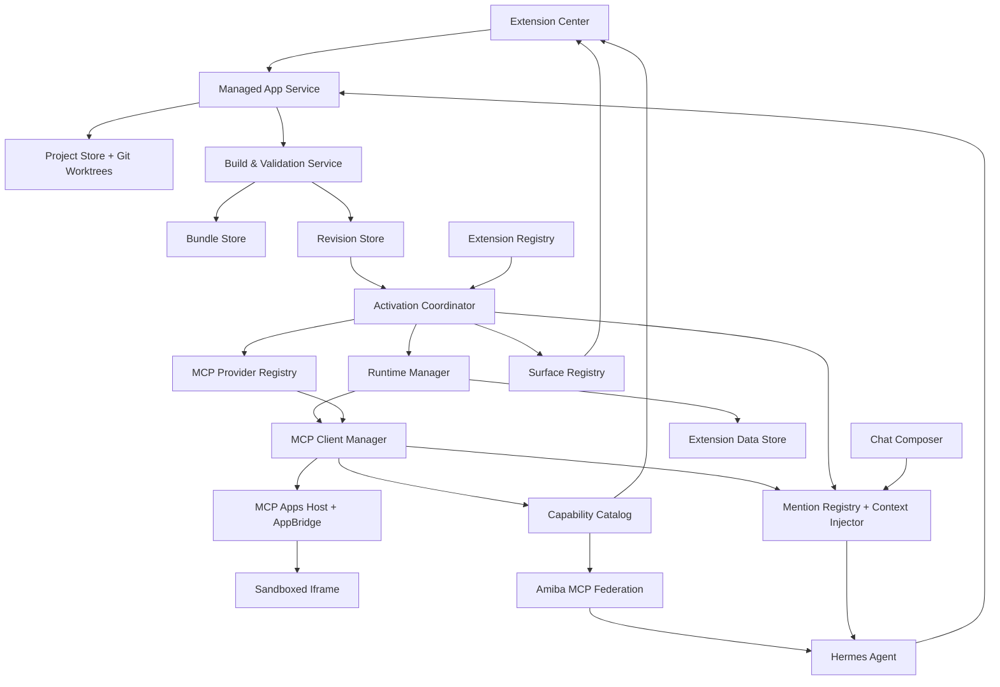
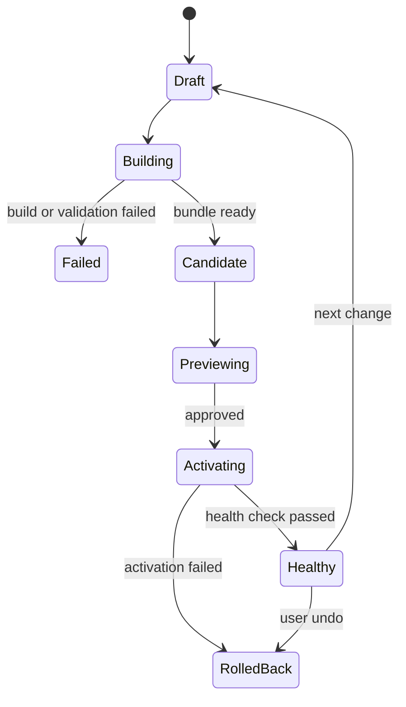
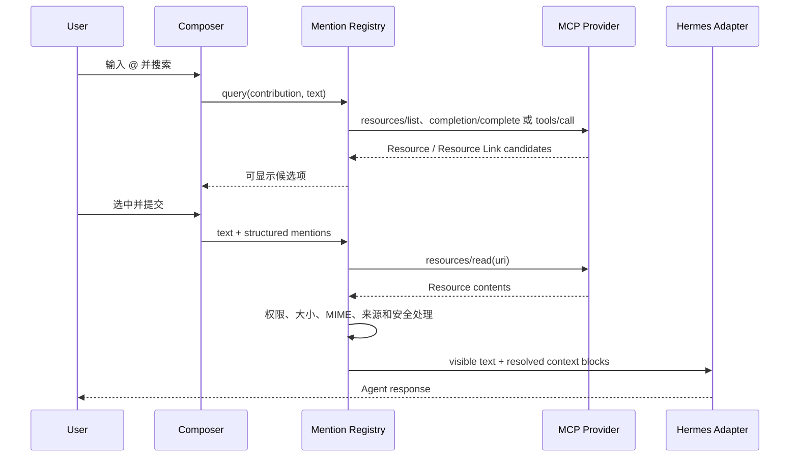
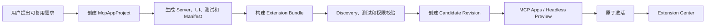

# Amiba 统一 Extension 与个人托管能力设计方案

> 日期：2026-08-06
>
> 状态：核心产品边界已冻结；Personal Managed 核心闭环已实现并通过验证
>
> 范围：Amiba Desktop、MCP Host、MCP Apps Host、Extension Center、Hermes 集成

## 1. 方案摘要

### 1.1 最终产品结论

Amiba 只保留一个面向用户的长期对象：**Extension**。

报告、网页、图表、图片合集等“内容”，计算器、表单等“交互页面”，以及带命令行或后端 Runtime 的“工具”，都属于 Extension 的不同能力形态。它们共享同一个管理入口、搜索、分类、收藏、版本、分享、删除恢复和权限体系，不再额外引入与 Extension 并列的 Artifact 产品概念。

这项合并只减少概念，不减少能力：

| 用户需求 | 统一后的归属 |
|---|---|
| 跨 Session 找回和收藏生成内容 | Extension Center 中的“我的创作”视图 |
| 搜索、标签、合集和来源 Session | Extension 与其下属 Output 的统一索引 |
| 保留源码修改历史 | Extension Project 的 Git 历史 |
| 查看、分享和管理最新内容 | 内容型 Extension 的主内容页 |
| 保留导出的图片、PDF、文件等结果 | 所属 Extension 下的 Output |
| 继续通过对话修改 | 从稳定 Commit 创建草稿，验证后生成新 Revision |
| 从静态页面升级为交互工具或后端服务 | 保持同一 Extension ID，提升能力级别 |

### 1.2 用户会看到什么

- 对话中的文本、图片、文件、HTML Preview、代码和 Tool Result 仍是消息内容，可以即时预览、下载和继续修改。
- 只有用户明确选择“保存为我的创作 / 工具”时，Amiba 才创建长期 Extension。
- 所有长期内容和工具都进入同一个 Extension Center；用户可以用“全部、我的创作、我的工具、已安装、市场、开发者模式”等视图筛选，但这些只是视图，不是六套对象。
- 普通用户面对的是创建、使用、搜索、改进、撤销、分享和删除，不需要理解 Git、Bundle、Revision、Runtime 或 MCP。

### 1.2.1 普通用户心智模型

普通用户始终只感知“一个可以持续改进的小应用”，而不是一个需要自行维护的源码项目、安装包或版本集合。绝大多数使用过程只有一条主路径：

```text
创建小应用 → 使用 → 发现问题 → 告诉 AI → AI 修改 → 查看新效果
```

产品层必须遵守以下原则：

- 用户管理小应用，系统管理版本。Git Commit、Bundle 和 Revision 都是不可见基础设施。
- 用户不需要主动发布、固化、命名、选择或清理版本，也不需要理解草稿、构建和激活。
- “让 AI 修改”是 Personal Managed Extension 的默认维护入口；Agent 负责定位源码、修改、测试、构建和交付新效果。
- 当前健康版本在修改期间继续可用。候选修改不能直接破坏用户正在使用的小应用。
- 安全修改通过验证后可以自动应用，并提供清晰的“撤销”；新增敏感权限、数据迁移、自动化行为变化和公开分享变化必须显式确认。
- 用户用自然语言表达恢复意图，例如“改坏了”“恢复到刚才可以用的状态”，Host 将其解析为 Revision 回滚，不要求用户选择技术版本号。
- 普通界面只展示“可用、正在改进、可以试用、已更新、更新失败但原版本不受影响”等用户状态。版本号、Commit、Bundle Hash、路径、Runtime 和原始权限 Token 只进入开发者模式或故障诊断。

Amiba 自动创建稳定恢复点，不把“固化版本”作为用户任务。至少在以下时机建立或保留恢复点：

- Agent 开始下一轮修改前。
- 候选修改通过验证并成功使用后。
- 小应用被分享、发布或导出时。
- 小应用被自动化、Workflow 或其他稳定依赖引用时。
- 权限、Provider、Runtime 或数据 Schema 变化前。

### 1.3 技术结论

Amiba 中的 Extension 是管理概念，不是另一套应用运行时。

- MCP Server / MCP App 负责业务逻辑、Tools、Resources、Prompts 和可选 UI。
- Extension 负责管理 MCP 实现的来源、安装、版本、权限、数据、入口、健康状态和回滚。
- Amiba 作为 MCP Host 启动或连接 MCP Server，并作为 MCP Apps Host 渲染 UI。
- Hermes、Extension Center、MCP Apps View 和自动化调用同一组 MCP Tools。
- Composer Mention 由 Amiba Host 管理，并把所选 MCP Resource 注入同一轮 Agent 上下文。
- 内部构建产物统一称为 `ExtensionBundle`，避免和产品层已经取消的 Artifact 概念混淆。

最终关系如下：

```text
MCP App Project ──build──▶ Extension Bundle
                              ▲
                              │ exact reference
Extension Revision ───────────┘
        ▲
        │ activeRevisionId
Extension Record
        ▲
        │ activate and run
Amiba MCP Host
```

运行时只有一条依赖链：

```text
Amiba Host ──▶ Extension Revision ──▶ MCP Provider / Bundle ──▶ MCP Protocol
```

MCP App 不依赖 Extension，不读取 Extension Revision，不调用 Extension 生命周期 API，也不使用 Amiba 私有业务协议。

普通用户看到的仍然可以叫“扩展”“我的工具”或“我的创作”；内部实现统一为受 Amiba 管理的静态 MCP App、MCP Server / MCP App 或已注册 MCP Provider。产品层不再引入与 Extension 并列的 Artifact 概念。

---

## 2. 核心概念与职责

### 2.1 概念定义

| 概念 | 定义 | 是否包含业务代码 |
|---|---|---:|
| MCP | Tools、Resources、Prompts、发现和调用协议 | 否 |
| MCP App | MCP Server 加可选 MCP Apps UI Resources | 是 |
| MCP App Project | MCP Server、UI、测试和依赖的源码工程 | 是，源码 |
| Extension Bundle | 构建后可运行的 MCP Server、UI Resources 或静态内容包 | 是，构建产物 |
| Extension Revision | 某次经过验证的 Provider、权限、Runtime 和数据 Schema 快照 | 否 |
| Extension Record | Amiba 中的安装、启用、入口和当前 Revision 记录 | 否 |
| Extension Output | Extension 运行产生的文件、图片、文档或 Resource 引用；从属于 Extension | 否，引用输出内容 |
| MCP Provider | Amiba 可以启动或连接的 MCP Server 实例定义 | 间接引用 |
| Amiba MCP Host | MCP Client、Runtime、权限、发现和路由平台 | 否 |
| Mention Contribution | 将 MCP Resource 投影为 Composer 中可搜索、可选择的上下文入口 | 否 |

### 2.2 控制面与数据面

MCP App 是数据面：

- 执行业务逻辑。
- 暴露 Tools、Resources 和 Prompts。
- 提供结构化结果以及文件、Resource 或 Output 引用。
- 可通过 MCP Apps 提供交互界面。

Extension 和 Amiba 是控制面：

- 决定安装什么、运行什么以及当前激活哪个版本。
- 管理 Runtime、依赖、权限、数据目录和安全策略。
- 将 MCP UI Resource 放到 Amiba 的 main/settings 等产品入口。
- 将 MCP Tools 放入手动搜索和 Hermes Agent 的能力目录。
- 将可 Mention 的 MCP Resources 放入 Composer，并在提交时完成读取、限流和上下文注入。
- 负责构建、验证、升级、回滚、导入、导出和卸载。

### 2.3 架构不变量

1. MCP App 只依赖 MCP/MCP Apps 标准及自己的业务依赖。
2. Extension 单向引用 Extension Bundle 或已注册 MCP Provider。
3. Tool Schema 只由 MCP Server 定义，通过 discovery 获取。
4. UI 与 Tool 的通信只使用 MCP Apps，不定义 Amiba 私有 View Bridge。
5. Extension Record 不包含可执行业务代码。
6. 当前运行 Bundle 不可变，升级通过创建新 Revision 完成。
7. 源码、构建产物、用户数据和安装记录分别存储。
8. 普通用户不需要操作 Git、依赖、进程、SemVer 或部署。
9. Mention 是 Host 对 MCP Resource 的产品投影，不是独立运行时，也不复制业务实现。
10. Git 保存全部源码演进；Revision 保存可部署状态；Bundle 只保存运行所需的构建结果，三者不能混用。
11. 搜索、收藏、标签、集合、来源 Session、分享、删除恢复和内容管理统一挂在 Extension 及其下属 Output 上，不创建第二套 Artifact 生命周期。
12. 临时 Preview 不自动安装；只有用户明确要求长期保存或复用时，才创建或更新 Extension。

### 2.4 Extension 能力级别

Extension 使用同一个 `ExtensionRecord` 和 Revision 生命周期，但能力可以逐步增强：

| 能力级别 | 典型内容 | Runtime | Agent 调用 |
|---|---|---|---|
| `static-content` | 报告、海报、图表、HTML/SVG/Markdown 内容 | `static-mcp-app` | 以 Resource/内容引用为主 |
| `interactive-ui` | 计算器、表单、浏览器端工作台 | `static-mcp-app` + sandboxed iframe | 可选，只读 Resource 或后续升级为 Tool |
| `tool-app` | 文件处理、数据查询、自动化、完整工作台 | Node/Python MCP Server | 通过 MCP Tools |
| `registered-mcp` | 已存在的本地或远程 MCP | 外部 Provider | 通过 MCP discovery |

同一个 Personal Managed Extension 可以保持 ID 和 Git 历史不变，从静态内容逐步升级为交互 UI，再升级为带 MCP Tools 的完整应用。

### 2.5 对话结果与临时预览

对话中的文本、图片、文件、代码、HTML Preview、Tool Result 和 MCP Resource Link 属于消息内容。Host 可以在 iframe、文件预览器或结果卡片中展示它们，但这些内容：

- 不拥有独立 Runtime、权限、数据 Schema、健康状态或安装记录。
- 不进入独立 Artifact Registry，也没有单独的 Artifact Center。
- 默认跟随 Session 保存；用户可以下载、复制或继续在当前对话中修改。
- 当用户选择“保存为我的工具 / 创作”时，Amiba 基于当前需求和内容创建 Extension Project，而不是把 Preview 原样改名为 Extension。

Extension Center 是唯一长期管理入口。它统一索引静态内容 Extension、交互应用、工具应用、已注册 MCP，以及这些 Extension 的下属 Outputs。

---

## 3. 领域模型

### 3.1 MCP App Project

`McpAppProject` 只在 Amiba 管理源码时存在：

```ts
interface McpAppProject {
  id: string;
  extensionId: string;

  repositoryPath: string;
  stableCommit: string;
  templateVersion: string;

  createdAt: string;
  updatedAt: string;
}
```

它负责保存：

- MCP Server 源码。
- MCP Apps UI 源码。
- 业务核心代码。
- 测试、构建配置和依赖锁文件。
- Amiba 管理 Manifest。

草稿修改使用独立 branch + worktree。Agent 只能修改 Amiba 发放的草稿 worktree，不能直接修改当前运行 Bundle。每次成功应用都必须创建 Git Commit；Git 是源码修改历史的真源。

### 3.2 Extension Bundle

`ExtensionBundle` 是内容寻址的不可变构建产物。静态内容、交互 UI 和完整 MCP App 使用同一种 Bundle 身份模型：

```ts
interface ExtensionBundle {
  hash: string;

  kind: "static-content" | "interactive-ui" | "mcp-app";
  runtime: "node" | "python" | "static-mcp-app";
  entry: string;
  transport: "stdio";

  runtimeLockHash: string;
  discoverySnapshotHash: string;
  uiResourceHashes: Record<string, string>;

  platform?: string;
  architecture?: string;
  createdAt: string;
}
```

Bundle 可以包含：

```text
bundle/
├── server/                       # 可执行 MCP Server
├── ui/                           # 构建后的 HTML/CSS/JS
├── content/                      # 静态内容 Extension 的主内容和预览资源
├── runtime-lock.json
├── discovery-snapshot.json
└── bundle.json
```

UI 和静态内容必须由 `static-mcp-app` 或 MCP Server 注册为 `ui://` / content Resources。Bundle 目录不是 View 的公共访问协议。

### 3.3 MCP Provider 引用

Extension Revision 通过 Provider 引用 MCP 实现：

```ts
type ResolvedMcpProvider =
  | {
      kind: "bundle";
      alias: string;
      bundleHash: string;
    }
  | {
      kind: "registered";
      alias: string;
      providerId: string;
      version: string;
      configHash: string;
      capabilitySnapshotHash: string;
    };
```

- `bundle`：Extension Bundle 由 Amiba 保存和运行。
- `registered`：MCP Server 已在 Amiba MCP Provider Registry 中登记，Extension 只锁定引用。

远程 Provider 如果不能提供不可变版本，Revision 只能保证配置和能力快照可追溯，不能承诺其远端行为可完整回滚。Amiba 必须在 UI 中标记“外部管理”。

### 3.4 Extension Revision

Revision 将源码、构建产物、权限和数据兼容性绑定为一个可部署状态：

```ts
interface ExtensionRevision {
  id: string;
  extensionId: string;
  parentRevisionId?: string;

  sourceCommit?: string;
  providers: ResolvedMcpProvider[];

  manifestSnapshotHash: string;
  permissions: string[];
  dataSchemaVersion: number;

  userRequest?: string;
  changeSummary: string;
  sourceSessionId?: string;

  status:
    | "candidate"
    | "previewing"
    | "activating"
    | "healthy"
    | "failed"
    | "rolled-back";

  createdAt: string;
  activatedAt?: string;
}
```

Revision 是 Amiba 实际升级和回滚的单位。Git Commit 或 Bundle Hash 都不能单独代替 Revision。Git 保存所有源码历史；MVP 至少保留当前 healthy Bundle 和上一个 healthy Bundle，以支持激活失败时立即回滚。更早版本通过对应 Commit、Manifest 和 lockfile 重新构建恢复。

### 3.5 Extension Record

Extension Record 是产品侧的安装记录和聚合根：

```ts
type ExtensionSource =
  | "bundled"
  | "marketplace"
  | "personal-managed"
  | "registered-mcp"
  | "developer-linked";

type ExtensionKind =
  | "static-content"
  | "interactive-ui"
  | "tool-app"
  | "registered-mcp";

interface ExtensionRecord {
  id: string;
  source: ExtensionSource;
  kind: ExtensionKind;

  name: string;
  description?: string;
  icon?: string;

  tags: string[];
  collectionId?: string;
  sourceSessionIds: string[];
  previewResourceUri?: string;

  projectId?: string;
  activeRevisionId?: string;

  enabled: boolean;
  pinned: boolean;
  archived: boolean;

  installedAt: string;
  updatedAt: string;
  lastUsedAt?: string;
}
```

Extension Record 不复制 Tool Schema、不保存可执行 Handler，也不成为 MCP App 的运行依赖。

### 3.6 Extension Output

Extension 运行产生的文件、图片、文档或 Resource 是 Extension 的下属内容，不是新的顶层产品对象：

```ts
interface ExtensionOutputRecord {
  id: string;
  extensionId: string;
  revisionId: string;
  sessionId?: string;

  kind: "file" | "image" | "document" | "resource";
  uri: string;
  name: string;
  mimeType?: string;

  tags: string[];
  pinned: boolean;
  createdAt: string;
}
```

Extension Center 的统一搜索可以同时命中 Extension 和其 Outputs，但打开 Output 时必须保留所属 Extension、Revision、Session 和来源 Tool。技术上可以为 Output 建立索引记录，产品上不提供独立 Artifact 身份或第二套生命周期。

---

## 4. Extension 来源模式

| 来源 | 源码所有者 | Project | Bundle | Provider | 主要用途 |
|---|---|---:|---:|---:|---|
| bundled | Amiba | 否 | Amiba 内置 | bundle | 内置应用 |
| marketplace | 发布者 | 本地通常无 | 下载并校验 | bundle 或 registered | 安装第三方应用 |
| personal-managed | Amiba / 用户 | 是 | Amiba 构建 | bundle | 对话创建与长期维护 |
| registered-mcp | 外部 Provider | 否 | Amiba 不拥有 | registered | 直接使用已有 MCP |
| developer-linked | 开发者 | 外部目录 | 开发构建 | development provider | 专业开发调试 |

### 4.1 Personal Managed

- 源码位于 Amiba 用户数据目录。
- Amiba 管理 Git、worktree、依赖、构建、Bundle、Revision 和数据。
- 用户通过对话创建和修改。
- 每次修改先形成候选 Revision，验证后才能激活。
- 可导出为普通 MCP App 项目。

### 4.2 Registered MCP

- MCP Server 已存在，可以是本地 stdio 或远程 Streamable HTTP。
- Amiba Provider Registry 保存连接、认证和能力快照。
- 如果 Provider 支持 MCP Apps，可直接获得交互 UI。
- 如果 Provider 只有 Tools，则作为 Headless Extension 使用。
- Extension Revision 锁定 Provider ID、版本、配置 Hash 和授权范围。

### 4.3 Developer Linked

- 项目位于开发者选择的外部目录。
- Amiba 不拥有、不复制、不删除源码。
- 开发者使用 Hermes、IDE 或其他 Coding Agent 开发。
- Amiba 提供运行、日志、MCP Inspector、MCP Apps 预览和热重载。
- 该模式以调试为目标，不承诺普通用户托管生命周期。

---

## 5. Project 与 Manifest

### 5.1 Personal Managed 项目结构

```text
project/
├── manifest.json                 # Amiba 管理和启动元数据
├── server.ts | server.py         # MCP Server 入口
├── src/
│   └── core/                     # 纯业务逻辑
├── ui/                           # MCP Apps UI 源码
├── skills/                       # 可选 Agent 使用说明
├── tests/
├── package-lock.json | requirements.lock
└── README.md
```

Manifest 只描述 Amiba 如何管理和启动 MCP Provider，以及如何将 UI Resource 投影到产品入口。Tool 和 UI 协议仍由 MCP/MCP Apps 定义。

### 5.2 Bundled Provider Manifest

```json
{
  "schemaVersion": 1,
  "id": "com.user.image-tools",
  "name": "图片工作台",
  "mcp": {
    "providers": [
      {
        "alias": "default",
        "kind": "bundled",
        "runtime": "python",
        "entry": "server.py",
        "transport": "stdio",
        "lockfile": "requirements.lock"
      }
    ]
  },
  "surfaces": {
    "main": {
      "provider": "default",
      "resourceUri": "ui://image-tools/main"
    },
    "settings": {
      "provider": "default",
      "resourceUri": "ui://image-tools/settings"
    }
  },
  "mentions": [
    {
      "id": "images",
      "provider": "default",
      "label": "图片",
      "resourceUriTemplate": "image://library/{id}",
      "searchTool": "search-images"
    }
  ],
  "permissions": [
    "storage",
    "filesystem:user-selected"
  ],
  "skills": [
    {
      "id": "image-workflow",
      "entry": "skills/image-workflow/SKILL.md"
    }
  ]
}
```

### 5.3 Registered Provider Manifest

```json
{
  "schemaVersion": 1,
  "id": "com.user.existing-image-tools",
  "name": "我的图片工具",
  "mcp": {
    "providers": [
      {
        "alias": "default",
        "kind": "registered",
        "providerId": "org.example.image-tools",
        "version": "1.4.2"
      }
    ]
  },
  "surfaces": {
    "main": {
      "provider": "default",
      "resourceUri": "ui://image-tools/main"
    }
  }
}
```

### 5.4 Manifest 规则

- Manifest 不声明 `actions` 或 Tool Handler。
- Manifest 不复制 `inputSchema`、`outputSchema` 或 Tool description。
- Manifest 不声明 View 与 Server 的私有 IPC。
- `surfaces` 只表示 Amiba 产品入口与 `ui://` Resource 的映射。
- `mentions` 只描述 MCP Resource 在 Composer 中的展示和检索映射；内容仍由 `resources/read` 提供。
- Provider 已通过 MCP Resource/Resource Template `_meta["com.amiba/mention"]` 声明展示信息时，Manifest 不重复声明；不可修改的已有 Provider 才使用 `mentions` overlay。
- `searchTool` 必须是只读 Tool，并在结果中返回标准 MCP Resource Links；Manifest 不复制搜索 Tool 的输入输出 Schema。
- Build 阶段验证 Manifest 引用的 Provider 和 UI Resource 确实存在。
- Manifest 快照进入 Revision，激活后不可原地修改。

---

## 6. MCP Server 与 MCP Apps 实现

### 6.1 Headless MCP Server

没有 UI 的 Extension 仍然是一等应用：

1. Amiba 连接 Provider 并执行 `tools/list`。
2. Tools 进入 Capability Catalog。
3. 用户可以在 Extension Center、全局搜索或命令面板找到 Tool。
4. Amiba 根据 `inputSchema` 自动生成表单。
5. Host 通过 `tools/call` 调用并渲染结构化结果。
6. Hermes 通过 Amiba MCP Federation 调用同一 Tool。

纯脚本能力使用 Node/Python MCP SDK 实现，不需要 CLI 作为普通用户入口。

### 6.2 Interactive MCP App

带界面的应用使用 MCP Apps：

```text
MCP Server
├── Tool: transform-image
└── Resource: ui://image-tools/workbench
                    │
                    ▼ resources/read
Amiba MCP Apps Host / AppBridge
                    │
                    ▼ JSON-RPC over postMessage
Sandboxed Iframe View
                    │
                    ▼ tools/call
MCP Server
```

Tool 与 UI Resource 的关联由 MCP Tool metadata 表达：

```json
{
  "name": "transform-image",
  "description": "裁剪、缩放并压缩图片",
  "_meta": {
    "ui": {
      "resourceUri": "ui://image-tools/workbench"
    }
  }
}
```

UI Resource 使用 `text/html;profile=mcp-app`。View 使用 MCP Apps SDK 与 Host 通信，不使用 `window.amiba.*` 业务 API。

### 6.3 View 与业务逻辑边界

以下逻辑留在 View：

- 拖动裁剪框。
- 即时缩放预览。
- 表单校验和界面状态。
- 展开、排序、分页等局部交互。

以下逻辑定义为 MCP Tool：

- Agent 需要调用的操作。
- 无界面手动运行需要调用的操作。
- 需要统一权限、审计、取消或持久化输出的操作。
- Preset、Workflow 或自动化需要复用的操作。

只供 View 使用的刷新、分页或保存临时界面状态 Tool 可以标记为 app-only，不进入 Agent 工具上下文。

### 6.4 UI-resource-only 应用

没有后端业务 Tool 的界面仍通过 MCP Apps 提供。Amiba 提供固定 `static-mcp-app` Runtime，用于注册静态 `ui://` Resources，避免创建第二种 UI-only 协议。

### 6.5 Composite MCP App

需要组合多个已有 Providers 时，可以构建 Facade MCP Server：

- 对外暴露稳定的业务级 Tools。
- 对内通过标准 MCP Client 调用声明过的下游 Providers。
- Provider 依赖和授权范围进入 Manifest 与 Revision。
- Facade 不能调用 Extension 生命周期 API。
- 无法在其他 Host 中满足的 Amiba 平台依赖必须显式标记。

---

## 7. Amiba Host 总体架构



### 7.1 Managed App Service

- 创建 Personal Managed Project。
- 发放和回收 Agent 草稿 worktree。
- 协调构建、预览、应用、回滚、导出和删除。
- 生成用户可读的修改摘要。
- 不直接执行 MCP Tool。

### 7.2 Build & Validation Service

- 使用固定工具链构建 Node、Python 和 UI Bundle。
- 执行类型检查、单元测试和契约测试。
- 启动候选 MCP Server 并完成 initialize/discovery。
- 校验 Tool Schema、UI Resources、CSP、权限和平台兼容性。
- 生成 discovery snapshot 和不可变 Extension Bundle。

### 7.3 MCP Provider Registry

- 登记本地 stdio、远程 Streamable HTTP 和 Amiba 内置 Providers。
- 保存 Provider ID、版本、连接配置、认证引用和健康状态。
- 为 Registered MCP Extension 提供稳定引用。
- Provider 卸载前检查 Extension 依赖。
- 不接管外部 Provider 的源码和数据。

### 7.4 Runtime Manager

- 启动、停止和重启本地 MCP Server。
- 管理 Node/Python Runtime 与隔离环境。
- 实现超时、取消、日志、心跳和资源限制。
- 将 Runtime 和依赖环境绑定到 Revision。
- 本地 Server 默认使用 stdio，不任意开放端口。

### 7.5 MCP Client Manager

- 持有每个已激活 Provider 的 MCP Client session。
- 执行 capability negotiation 和 discovery。
- 路由 `tools/call`、`resources/read` 和 prompts 请求。
- 处理列表变更、进度、取消和连接恢复。
- 在调用前执行 Extension Revision 和权限校验。

### 7.6 Capability Catalog

- 缓存 Tools、Resources、Prompts 和 UI metadata。
- 只暴露当前健康 Revision 的能力。
- 为用户搜索、自动表单、Hermes 和自动化提供同一份元数据。
- 使用 Extension ID + Provider Alias + primitive name 建立稳定命名空间。
- Build snapshot 用于快速浏览，运行时 discovery 是能力真源。

### 7.7 MCP Apps Host

- 协商 MCP Apps 能力。
- 获取和验证 `ui://` Resources。
- 在 sandboxed iframe 中渲染 View。
- 使用 AppBridge 代理 JSON-RPC over `postMessage`。
- 提供主题、语言、时区、容器尺寸和 display mode context。
- 执行 CSP、权限、外部链接和 Tool 调用策略。

### 7.8 Amiba MCP Federation

- 对 Hermes 暴露一个聚合 MCP Server。
- 将已启用 Extension Tools 映射为带命名空间的 Tools。
- 将 `tools/call` 路由到对应 MCP Client。
- 支持渐进式发现和动态工具列表变更。
- 排除 app-only Tools。
- 记录 Extension、Revision、Provider、Tool 和 Preset 审计信息。

### 7.9 Surface Registry

- 将 Revision 中的 `surfaces.main/settings` 注册到 Amiba 路由。
- 只保存 Extension 到 Provider/UI Resource 的映射。
- 控制侧边栏固定、Extension Center 打开和设置页入口。
- 不参与 View 与 Server 的业务通信。

### 7.10 Mention Registry 与 Context Injector

- 从当前激活 Revision 和 MCP discovery 建立可 Mention Resource 目录。
- 为 Chat Composer 提供分类、搜索、补全、图标和显示字段。
- 保存结构化 Mention token，并在消息提交时调用 `resources/read` 解析内容。
- 执行权限、大小、MIME、超时、来源标注和 Prompt Injection 防护。
- 将解析后的 Resource 内容注入 Hermes 上下文；不把 UI 标签当成实际内容。
- 通过适配器对接 Hermes 动态上下文引用能力，但不以该上游能力作为 Amiba 的运行前提。

---

## 8. 构建、Revision 与激活

### 8.1 单向构建流程

```text
1. 从稳定 Commit 创建草稿 worktree
2. Agent 修改 MCP Server、UI 和测试
3. Build Service 生成 Extension Bundle
4. 启动候选 Bundle 并完成 discovery、测试和权限比较
5. 创建 candidate Extension Revision
6. 在独立 MCP Client session 和 iframe 中预览
7. 原子激活 Revision
8. 健康检查通过后标记 healthy
9. 更新 ExtensionRecord.activeRevisionId
```

Revision 在 Bundle 构建完成后创建。Bundle 不需要知道 Revision ID，因此不存在循环依赖。

### 8.2 状态机



### 8.3 原子激活

激活事务必须同时更新：

- 当前 Revision 指针。
- MCP Provider/Bundle 解析结果。
- Runtime 和依赖环境。
- 权限集合。
- Capability Catalog。
- Surface Registry。
- Mention Registry。
- Skill 注册。
- 数据 Schema 状态。

任一关键步骤失败，恢复到上一个健康 Revision。

### 8.4 版本语义

| 标识 | 用途 |
|---|---|
| Git Commit | 源码状态 |
| Bundle Hash | 构建产物身份 |
| Extension Revision ID | 实际可部署状态 |
| Package SemVer | Marketplace 发布版本 |
| MCP Protocol Version | 协议兼容版本 |

普通用户只看到自然语言修改记录、当前状态和“撤销”。

Revision 历史不作为普通用户需要维护的版本列表。系统自动保留当前健康 Revision、修改前恢复点以及分享、发布、自动化引用等隐式稳定边界；清理策略由保留规则执行。只有开发者模式和故障诊断可以直接查看 Revision ID、Commit、Bundle Hash 与状态机。

---

## 9. Runtime 与依赖

### 9.1 Node/TypeScript

- 使用官方 MCP SDK。
- 构建时完成编译和依赖打包。
- Bundle 运行时不执行 `npm install`。
- 适合计算、文本、文件、网络和通用业务逻辑。

### 9.2 Python

- 使用 Amiba 分发的固定 Python Runtime。
- 使用官方 MCP Python SDK。
- Python 版本、lockfile 和环境 Hash 进入 Bundle/Revision。
- 环境按内容 Hash 缓存复用。
- 不依赖用户系统 Python，不要求用户管理 venv。

### 9.3 混合实现

一个 Extension Revision 可以引用多个 Providers。对外需要稳定业务语义时，使用一个主 Facade MCP Server 聚合 Node/Python 或远程 Providers。

多 Provider 调用必须声明依赖、权限、超时和失败策略，不能通过任意子进程或未登记端口隐式连接。

### 9.4 依赖约束

- 所有依赖必须锁定。
- 原生模块声明 OS/Arch 兼容性。
- Runtime 和依赖 Hash 是 Revision 的组成部分。
- 新增原生依赖、外部可执行文件或 Runtime 需要用户确认。
- 运行时依赖缺失不能触发静默在线安装。

---

## 10. UI 与产品入口

### 10.1 UI 技术规范

- UI 统一为 MCP Apps HTML Resource。
- Personal Managed 默认使用 React + TypeScript。
- 推荐使用 Amiba UI SDK，但通信使用 MCP Apps SDK。
- 专业开发者可以使用任意 Web Framework。
- 最终输出必须符合 MCP Apps UI Resource 和安全规范。

### 10.2 UI Surface

MVP 支持：

- `main`：Extension 的主要操作页面。
- `settings`：长期配置页面。

Tool 自身通过 `_meta.ui.resourceUri` 关联 UI。Amiba 通过 `surfaces` 将 UI Resource 映射到 Extension Center 或侧边栏入口。

后续可以支持 MCP Apps 的 inline、fullscreen 和 pip display modes，但 Host 始终决定最终展示方式。

### 10.3 直接打开

用户不经过 Agent 打开 Extension 时：

```text
Extension Center
    ↓ active Revision
Surface Registry
    ↓ provider + ui:// resource
MCP Apps Host
    ↓ resources/read
Sandboxed Iframe
```

如果 Extension 没有 main Surface，则展示其 Tools、Resources、运行历史和自动生成表单。

### 10.4 UI 安全基线

- 所有 UI 运行在 sandboxed iframe。
- UI 不能访问宿主 DOM、Cookie 或宿主 Local Storage。
- 通信只走可审计的 JSON-RPC over `postMessage`。
- 默认拒绝未声明网络来源。
- CSP 和 UI permissions 来自 MCP Apps metadata，并与 Extension 权限取交集。
- 外部链接使用 MCP Apps `ui/open-link`。
- 每个 Extension/Revision 使用隔离 Origin、Cache 和数据命名空间。

---

## 11. Mention 与上下文注入

### 11.1 定位

Mention 是 Amiba Host 的产品 Surface，负责让用户在 Composer 中选择上下文；MCP Provider 仍然负责搜索、读取和返回实际资源。

```text
MCP Provider: Resources / Resource Templates / Search Tool / resources/read
Extension:    Provider 来源、Revision、权限和 Mention 展示 overlay
Amiba Host:   @ 选择器、结构化 token、上下文解析与注入
Hermes:       使用已经注入的上下文完成推理
```

因此不新增 `Mention Server`、`Mention Runtime` 或第二套资源协议。Mention 也不属于 MCP App View；View 内的交互状态可以使用 MCP Apps `ui/update-model-context`，Composer 的外部资源选择则由 Mention Registry 处理，两者互不替代。

### 11.2 Contribution 来源

可 Mention 能力有两种声明位置，激活时统一归一化进 Mention Registry：

1. Personal Managed Provider 在 MCP Resource 或 Resource Template 的 `_meta["com.amiba/mention"]` 中声明标签、图标和展示字段。
2. 无法修改的 Registered Provider 由 Extension Manifest 的 `mentions` 提供展示 overlay，并引用已有 Resource Template 或搜索 Tool。

overlay 只负责产品展示和能力映射，不能复制 Resource 内容 Schema 或实现搜索逻辑。Extension 禁用、回滚或卸载时，对应 Contribution 随 Revision 原子移除。

### 11.3 检索策略

Host 根据数据规模和 Provider 能力选择标准 MCP 原语：

| 场景 | MCP 实现 | Host 行为 |
|---|---|---|
| 少量固定资源 | `resources/list` | 分页缓存并在本地过滤 |
| URI 模板参数补全 | `resources/templates/list` + `completion/complete` | 在当前参数位置提供候选值 |
| 大规模或语义搜索 | 只读 MCP Tool | 传入查询条件，并读取结果中的 Resource Links |
| 选中资源取内容 | `resources/read` | 按 URI 读取真实内容 |

MCP 当前没有通用的全文资源搜索方法，因而 `searchTool` 只是 Extension 对已有标准 MCP Tool 的映射。该 Tool 必须声明只读、无副作用，并返回标准 Resource Links；业务搜索协议仍由其 Tool Schema 定义。

### 11.4 Composer 数据模型

Composer 不把 Mention 提前降级成一段普通文本，而是同时保存用户可见文本和结构化引用：

```ts
interface McpResourceMention {
  type: "mcp-resource";
  extensionId: string;
  revisionId: string;
  providerAlias: string;
  contributionId: string;
  uri: string;
  title: string;
  mimeType?: string;
}

interface ComposerSubmission {
  text: string;
  mentions: McpResourceMention[];
}
```

`revisionId` 固定用户选中时的能力快照。草稿跨越升级后，Host 优先从原 Revision 解析；原 Revision 已不可用时将 Mention 标记为失效并要求重新选择，不静默切换到含义可能不同的新资源。

### 11.5 提交与注入流程



注入规则：

- 用户可见消息保持原文；Resource 内容通过独立的上下文块传给 Hermes Adapter。
- 每个上下文块保留 Extension、Revision、Provider、URI、MIME 和标题等来源信息。
- Resource 内容默认视为不可信数据，不允许其中的指令覆盖系统或用户意图。
- Host 对单资源和单轮总量设置字节、Token、超时和 MIME 白名单限制。
- 超限内容注入带来源的摘要或截断预览，同时保留可再次读取的 URI。
- 读取前再次执行 Revision、Provider 健康状态和权限检查，并写入调用审计。
- 任一 Mention 解析失败时明确标注失败项，不把显示标签伪装成已成功注入的内容。

仅当 Hermes 接口暂时只能接收纯文本时，Adapter 才把已解析内容序列化为带明确边界和来源的上下文段；Composer 和内部 API 仍保留结构化对象。

### 11.6 与 Agent Tool 调用的关系

Mention 和 Tool 是互补能力：

- Mention 负责“把哪个现有对象带入这轮上下文”。
- Tool 负责“对这个对象执行什么操作”。
- Mention 选中的 Resource URI 可以作为后续 Tool 参数，但必须经过 Tool Schema 和权限校验。
- 同一 Extension 可以同时贡献 UI Surface、Mention Resources 和 Agent Tools，三者都绑定同一 active Revision。

例如图片工作台可以让用户 `@商品原图` 后要求“按我的商品图 Preset 压缩”；Host 先通过 `resources/read` 注入图片元数据或 Extension Output 引用，Hermes 再调用同一 Extension 的 `transform-image` Tool。

### 11.7 生命周期收敛

目标架构不再维护独立的 `~/.hermes/mention-sources` 安装单元。原先 Mention Source 中的能力按以下方式归位：

- 搜索和解析逻辑进入 MCP Provider。
- 展示字段进入 MCP `_meta` 或 Extension Manifest overlay。
- 安装、更新、权限、健康检查和版本绑定进入 Extension Revision。
- Composer 查询与消息注入进入 Amiba Mention Registry / Context Injector。

这样 Mention 不再拥有独立 Git 仓库、软链、版本或生命周期；它只是当前 Revision 对 Host 的一种能力贡献。

### 11.8 Hermes 上游适配

Amiba 的 Mention 主链路在 Host 内完成，不依赖 Hermes 是否原生支持动态 `@prefix`。Hermes 上游提供动态 Context Reference Provider 后，Amiba 可以增加适配器，把同一 Mention Registry 投影到 Hermes CLI/TUI/Gateway，以获得入口一致性；上游能力不能反向成为 Desktop Composer 的真源。

---

## 12. 权限、隔离与审计

### 12.1 权限模型

基础权限包括：

```text
storage
network:<domains>
filesystem:user-selected
filesystem:extension-data
clipboard
notifications
camera
microphone
subprocess
mcp.call:<provider-id>
mcp.expose-to-agent
```

规则：

- 默认拒绝网络、任意文件系统、子进程和设备权限。
- 权限绑定 Revision。
- 权限增加需要用户确认；权限减少可以自动应用。
- MCP Tool annotations 只是提示，不能代替权限判断。
- View、手动运行、Hermes 和自动化调用都经过同一权限检查。

### 12.2 Runtime 隔离

- 每个本地 Provider 只访问自己的 Bundle、数据目录和临时目录。
- 限制 CPU、内存、执行时间、输出大小和子进程。
- 文件输入通过用户授权引用或 Amiba Resource/Output Reference 传递。
- 不允许路径穿透或直接访问其他 Extension 数据。
- 对不能可靠隔离的能力展示明确风险，不允许静默提权。

### 12.3 调用审计

每次 MCP 调用记录：

```text
extensionId
revisionId
providerAlias / providerId
toolName
toolCallId
presetId?
caller: view | user | hermes | automation
permissionDecision
input/output Resource or Extension Output references
duration and result status
```

敏感参数和密钥不得写入普通日志。

---

## 13. 数据、迁移与密钥

### 13.1 数据分层

```text
Project：源码、测试、Manifest、lockfile
Bundle：构建后的 MCP Server、UI Resources 和内容资源
Revision：Provider、权限、Runtime、数据 Schema 快照
Data：用户配置、历史和业务数据
Secrets：系统安全存储中的认证信息
```

用户数据不进入 Git 或 Bundle。

### 13.2 Extension Data Store

- 每个 Extension 获得独立 namespaced 数据目录。
- 小型配置使用 key-value API。
- 结构化业务数据使用 Amiba 管理的 SQLite/Data Store。
- 外部文件只保存授权引用，不擅自移动或删除。
- MCP Server 通过 Runtime 授予的数据目录访问数据，不读取 Extension Registry。

### 13.3 数据迁移

激活新 Revision 时：

1. 创建数据事务或备份。
2. 使用候选 Revision 执行声明过的迁移。
3. 验证数据 Schema 和候选 Runtime。
4. 健康检查通过后提交。
5. 失败时恢复旧数据和旧 Revision。

Registered MCP 的远端数据由 Provider 管理，Amiba 只管理本地配置、认证引用和 Preset，并明确展示备份边界。

### 13.4 密钥

- OAuth Token、API Key 和密码进入系统安全存储。
- Manifest、Git、Bundle、日志和普通设置中只保存 secret reference。
- Revision 回滚不能把已经撤销的凭据重新启用。

---

## 14. Preset、Skill 与自动化

### 14.1 Preset

Preset 保存用户花时间调整出的稳定参数：

```ts
interface McpToolPreset {
  id: string;
  extensionId: string;
  providerAlias: string;
  toolName: string;

  name: string;
  description?: string;
  arguments: Record<string, unknown>;

  revisionConstraint?: string;
  createdFromSessionId?: string;
  sampleOutputIds?: string[];
}
```

View、自动表单、Hermes 和自动化都向同一个 MCP Tool 传递 Preset arguments。Revision 升级导致 Tool Schema 变化时，Amiba 执行兼容检查、迁移或提示修复。

### 14.2 Skill

Skill 是可选的 Agent 使用说明层，适用于：

- Tool 有复杂适用条件或常见陷阱。
- 需要组合多个 Tools。
- 需要指导 Agent 选择 Preset。
- 调用前后需要解释、校验或人工确认。

Skill 引用 Extension ID、Provider Alias 和 Tool name，不直接运行源码，不绕过 MCP 修改数据。

### 14.3 自动化

定时任务、事件触发和 Workflow 通过 Extension Revision 解析 Tool，再执行标准 `tools/call`。自动化记录必须锁定 Extension、Tool、Preset 和权限上下文。

---

## 15. Agent 创建与修改流程

### 15.1 创建



用户可以显式要求“保存成工具”，也可以由 Agent 建议保存。Amiba 不自动持久化所有临时脚本。

### 15.2 修改

普通用户可见的交互闭环是：

```text
使用小应用 → 描述问题或想要的变化 → AI 修改 → 查看效果 → 继续使用或要求撤销
```

用户不需要先创建开发任务、选择分支、固化当前版本或在版本列表中选择发布目标。以下步骤全部由 Amiba 和 Agent 在后台完成：

1. 定位 Extension Record 和当前健康 Revision。
2. 从对应稳定 Commit 创建草稿 worktree。
3. Agent 修改 MCP App 源码和测试。
4. Build Service 生成新 Bundle。
5. 比较 discovery、UI Resources、权限和数据 Schema。
6. 创建候选 Revision 并预览。
7. 安全变更可自动应用；高风险变更需要确认。
8. 原子激活并健康检查。
9. 失败自动回滚；成功显示自然语言摘要和“撤销”。

默认交付策略：

- 纯 UI、内容和兼容性修复等低风险变更，在验证通过后自动激活，用户直接查看新效果。
- 新增敏感权限、不可逆数据迁移、影响既有自动化或公开行为的变更，在激活前请求确认。
- 修改失败、构建失败或健康检查失败时，继续运行原健康 Revision，只向用户说明“本次修改未生效”。
- 用户继续反馈时，Agent 基于当前健康状态开启下一轮修改；用户表达不满意或要求恢复时，回滚到最近适用的自动恢复点。

### 15.3 Agent 生命周期 API

```text
managedExtensions.create
managedExtensions.createDraft
managedExtensions.getDraftWorkspace
managedExtensions.validate
managedExtensions.build
managedExtensions.preview
managedExtensions.apply
managedExtensions.discardDraft
managedExtensions.rollback
managedExtensions.export
managedExtensions.delete
```

约束：

- API 只返回草稿 worktree，不返回当前 Bundle 的可写路径。
- Agent 不能直接修改 Extension Registry、Revision Store 或 active pointer。
- Build/Apply 必须由 Amiba 执行。
- Apply 记录来源会话、原始请求、Diff、权限变化和测试结果。

---

## 16. Extension Center

### 16.1 信息架构

```text
扩展
├── 全部              # 一个统一列表，默认入口
├── 我的创作          # static-content + interactive-ui
├── 我的工具          # tool-app + personal-managed
├── 已安装            # bundled + marketplace + registered-mcp
├── 扩展市场          # marketplace
└── 开发者模式        # developer-linked
```

这些是同一份 Extension Registry 上的筛选视图，不是互相独立的资产中心。一个 Extension 底层可以解析为 Amiba Bundle 或 Registered MCP Provider；用户不需要理解两种实现差异。

统一搜索同时索引：

- Extension 名称、描述、类型、标签、合集和能力。
- 当前主内容，以及用户明确收藏的 Extension Outputs。
- 来源会话、更新时间、最近使用和 Provider 健康状态。
- Git 提交的自然语言摘要；源码本身默认不进入全文索引。

静态报告、网页、图表和海报也进入“扩展”，但卡片可以使用“创作”这一更自然的展示文案。它们与工具型 Extension 共用收藏、分类、搜索、分享、删除恢复和源码版本机制。

### 16.2 Extension 操作

- 打开 main Surface。
- 浏览和运行 MCP Tools。
- 搜索、收藏、固定和查看最近使用。
- 添加标签、加入合集，并按类型、来源会话和更新时间筛选。
- 通过对话创建或修改。
- 查看自然语言修改记录。
- 撤销最近修改，或用自然语言恢复到之前可用的状态；不要求用户固定或选择技术版本。
- 查看当前主内容和已收藏的运行输出。
- 将一次性会话结果显式保存为新的 Extension，或保存为现有 Extension 的 Output。
- 查看权限、数据占用和 Provider 健康状态。
- 管理 Preset 和 Skill。
- 导出项目或安装包。
- 删除与恢复。

普通用户入口以“打开使用”和“让 AI 修改”为主操作。安装来源、版本号、Extension ID、文件路径、Runtime、原始权限 Token、重载和 Revision 列表不应占据普通详情页；它们属于开发者模式或按需展开的诊断信息。普通详情页只需要表达：

- 小应用做什么以及如何打开使用。
- 当前是否可用，是否正在被 AI 改进。
- 最近一次修改的自然语言摘要。
- 修改成功后查看效果和撤销，修改失败时确认原版本仍可用。
- 只有确实需要用户决策时，展示权限、数据或自动化影响确认。

### 16.3 Headless Extension 展示

没有 UI Resource 时，详情页展示：

- Tools 列表和搜索。
- 基于 `inputSchema` 的自动表单。
- 原始 JSON 输入模式。
- 结构化结果、文件和图片预览。
- 调用历史和权限。
- Preset 保存入口。

### 16.4 内容型 Extension 展示

`static-content` 和 `interactive-ui` 的详情页以当前主内容为核心，同时保留 Extension 的管理能力：

- 默认只展示当前健康 Revision 的主内容，不额外暴露“Artifact 版本”概念。
- 每次成功修改都提交 Git，并记录 Revision；用户可以按自然语言修改记录恢复到任意可重建版本。
- MVP 物理保留当前健康 Bundle 和上一个健康 Bundle；更早版本从 Git Commit、Manifest 和 lockfile 重建。
- 对话或 Tool 运行生成的文件、图片、文档和 Resources 可以作为 Extension Output 收藏、搜索和分类。
- 未被保存的一次性预览继续只属于会话消息，不进入 Extension Center。
- 分享、导出、删除和恢复以 Extension 为主体；Output 始终显示所属 Extension 和来源 Revision。

---

## 17. 存储布局

Personal Managed Extension 使用独立项目存储：

```text
<userData>/managed-extensions/<extension-id>/
├── repo.git/
├── worktrees/
│   └── <draft-id>/
├── bundles/
│   └── <bundle-hash>/
├── revisions/
│   └── <revision-id>.json
├── outputs/
│   └── <output-id>.json
├── data/
├── data-backups/
└── state.json
```

全局控制面存储：

```text
<userData>/extensions/
├── registry.json
├── provider-registry.json
├── bundle-index.json
├── output-index.json
├── search-index/
└── transactions/
```

约束：

- `repo.git` 只保存源码和构建输入。
- Bundle 目录不可变。
- Registry 只引用 Bundle/Revision，不复制源码。
- Output 是 Extension 的从属记录，不能脱离所属 Extension 成为另一套一级生命周期。
- 数据和密钥不进入 Git。
- active pointer 使用事务和原子 rename 更新。

---

## 18. 目标模块划分

```text
packages/managed-extensions/             # Project、Draft、Git 和 Agent 生命周期
packages/app-build/                # 构建、测试和契约验证
packages/bundle-store/             # 不可变 Extension Bundles
packages/extension-revisions/      # Revision 状态机与回滚
packages/extension-registry/       # Extension Records
packages/extension-outputs/        # 从属内容与运行输出
packages/extension-search/         # Extension、Output 与修改摘要索引
packages/mcp-provider-registry/    # 本地/远程 Provider 登记和依赖
packages/mcp-runtime/              # Node/Python Runtime Manager
packages/mcp-host/                 # MCP Client Manager 与权限路由
packages/mcp-apps-host/            # UI Resource、AppBridge 和 iframe
packages/capability-catalog/       # Tools/Resources/Prompts/UI metadata
packages/mcp-federation/           # Hermes 聚合 MCP Server
packages/surface-registry/         # main/settings 与 ui:// 映射
packages/mention-context/          # Mention Registry、检索与上下文注入
packages/extension-data/           # 数据、备份、迁移和 Secret refs
packages/extension-ui-sdk/         # React 模板和视觉组件
apps/desktop/extensions/           # Extension Center UI
```

`Activation Coordinator` 跨 Registry、Revision、Runtime、Catalog、Surface、Mention 和 Data Store 执行原子事务。

---

## 19. 失败与恢复

| 失败点 | 当前版本 | Amiba 行为 |
|---|---|---|
| Agent 修改失败 | 不受影响 | 保留或丢弃草稿 |
| 依赖解析失败 | 不受影响 | 不生成 Bundle |
| 构建或测试失败 | 不受影响 | Revision 标记 failed |
| MCP initialize/discovery 失败 | 不受影响 | 拒绝候选 Revision |
| UI Resource/CSP 校验失败 | 不受影响 | 拒绝预览或激活 |
| 权限增加未批准 | 不受影响 | 等待用户确认 |
| Preview 崩溃 | 不受影响 | 停止候选 Runtime |
| 激活失败 | 短暂切换 | 原子恢复旧 Revision |
| 健康检查失败 | 继续使用旧版 | 自动回滚 |
| 数据迁移失败 | 数据不丢失 | 恢复备份和旧 Revision |
| Registered Provider 失联 | Extension 不可用 | 展示外部 Provider 故障，不替换 Provider |
| Mention Resource 失效 | 消息草稿保留 | 标记失效并要求重选，不静默替换 URI 或 Revision |
| Git 仓库损坏 | 已安装版本继续运行 | 当前 Bundle 继续可用，项目标记不可编辑 |

---

## 20. 验收场景

### 20.1 房贷计算器

1. 用户要求保存一个房贷计算器。
2. Agent 创建 Personal Managed MCP App Project。
3. Server 暴露 `calculate-mortgage` Tool，并提供 MCP Apps 表单和结果 UI。
4. Amiba 构建 Bundle、创建 Revision、预览并激活。
5. 用户可以直接从 Extension Center 打开 UI。
6. 用户也可以让 Hermes 调用同一 Tool 并总结结果。
7. 修改提前还款逻辑时生成新 Bundle 和 Revision，失败可回滚。

### 20.2 Headless 文件整理工具

1. Agent 创建只包含 `rename-files` Tool 的 MCP Server。
2. Extension 没有 main Surface。
3. Tool 在 Extension Center 和全局搜索中可见。
4. Amiba 根据 Tool Schema 自动生成表单。
5. Hermes 调用同一 Tool。
6. 所有调用使用同一 Revision、权限和审计记录。

### 20.3 图片工作台与 Preset

1. MCP App 提供 `inspect-image`、`transform-image` 和 `batch-transform` Tools。
2. `ui://image-tools/workbench` 提供裁剪、缩放和压缩界面。
3. 用户将满意参数保存为“我的商品图” Preset。
4. Provider 将图库 Resource 暴露为 Mention Contribution，用户可在 Composer 中选择 `@商品原图`。
5. Host 读取该 Resource 并注入上下文，Hermes 使用“我的商品图” Preset 调用同一 `transform-image` Tool。
6. View、自动表单和 Hermes 都能使用该 Preset 调用同一 Tool。
7. Tool Schema 升级时 Amiba 检查 Preset 和 Mention overlay 兼容性。

### 20.4 已有 MCP Provider

1. 用户在 Amiba 登记已有 MCP Server。
2. Provider Registry 完成连接、认证和 discovery。
3. Amiba 创建 `registered-mcp` Extension Record 和 Revision。
4. 如果 Provider 支持 MCP Apps，用户可直接打开其 UI。
5. 如果只提供 Tools，则显示自动表单和 Tool 列表。
6. 如果提供 Resources，Extension 可将它们投影为 Composer Mention；全文检索可以映射到返回 Resource Links 的只读 Tool。
7. Extension 锁定 Provider 版本和配置，不发生静默漂移。

### 20.5 专业开发调试

1. 开发者链接外部 MCP App 项目。
2. Amiba 启动开发 Provider 并提供日志、Inspector、UI 预览和热重载。
3. 外部源码和 Git 始终由开发者负责。
4. 解除链接只删除注册记录，不删除项目。

### 20.6 静态研究报告

1. Hermes 在会话中生成一次性的报告预览；此时它只是消息内容。
2. 用户选择“保存为我的创作”，Amiba 创建 `static-content` Extension 和 Git 项目。
3. 报告源码、数据引用、样式和构建配置进入 Git，当前 HTML/SVG/Markdown 进入 Bundle。
4. Extension 出现在统一 Extension Center，可跨 Session 搜索、加标签、加入合集、收藏、分享和恢复。
5. 用户在另一会话要求更新数据或版式，Agent 从稳定 Commit 创建草稿并提交新的源码版本。
6. 默认界面只显示最新主内容；历史版本按需从 Git 和 Revision 重建，不创建独立 Artifact Center。
7. 报告导出的图片、PDF 或数据文件可以作为该 Extension 的 Output 被收藏和检索。

---

## 21. 实现约束清单

1. Extension 是管理 MCP 实现的控制面对象，不是运行时。
2. MCP Server / MCP App 是实际业务实现和运行产物。
3. Personal Managed 源码对象统一命名为 `McpAppProject`。
4. 构建产物统一命名为 `ExtensionBundle`，并按内容 Hash 保存；“Artifact”不作为内部构建对象或用户一级概念。
5. `ExtensionRevision` 绑定源码 Commit、Provider、Bundle、权限、Runtime 和数据 Schema。
6. `ExtensionRecord` 只保存安装状态和 active Revision。
7. MCP App 不反向依赖 Extension。
8. Tool Schema 和 UI 关联只在 MCP Server 中定义。
9. UI 使用 MCP Apps，不定义 `window.amiba` 业务 Bridge。
10. `surfaces` 只是 Amiba 入口到 `ui://` Resource 的映射。
11. Amiba 是统一 MCP/MCP Apps Host。
12. Hermes、View、自动表单和自动化调用同一个 MCP Tool。
13. Personal Managed 默认支持 Node/TypeScript、Python 和 static MCP App Runtime。
14. Existing MCP 通过 Provider Registry 引用，不复制或侵入其源码。
15. Git Commit、Bundle Hash、Extension Revision、Package SemVer 和 MCP Protocol Version 各司其职。
16. Bundle 不可变，激活和回滚以 Revision 为单位。
17. 权限必须在 iframe、AppBridge、MCP Client 和 Runtime 层实际执行。
18. Preset 是用户数据，绑定 Extension、Provider 和 Tool。
19. Skill 是可选使用说明，不是执行协议。
20. 普通用户只接触创建、使用、改进、撤销、分享和删除。
21. Mention 是 Host Surface，不是独立 Provider、Runtime 或 Extension 类型。
22. Mention 搜索和读取只调用标准 MCP Resources、Completion 和 Tools。
23. Composer 内部保存结构化 Resource 引用，不以纯文本标签作为上下文真源。
24. Mention Contribution、权限和可用性必须跟随 active Revision 原子切换。
25. Extension 是唯一面向用户的持久化内容与能力对象；不建立独立 Artifact Registry、Artifact Center 或 Artifact 生命周期。
26. 跨 Session 收藏、搜索分类、内容管理和源码版本历史必须由 Extension、Output、Git 和 Revision 共同覆盖。
27. 一次性会话结果默认不持久化；只有用户显式保存时才创建 Extension 或 Extension Output。
28. 普通用户始终感知一个持续演进的小应用，不感知需要维护的版本集合；Revision 是系统基础设施，不是用户一级对象。
29. Personal Managed Extension 必须把“让 AI 修改 → 查看效果 → 继续使用或撤销”作为默认维护闭环，不要求用户执行分支、构建、发布或版本固化操作。
30. 系统必须自动创建和保留修改前、健康激活后、分享发布、自动化引用及高风险变更前的恢复点。
31. 版本号、Commit、Bundle Hash、路径、Runtime、原始权限 Token、重载和 Revision 管理默认只在开发者模式或故障诊断中展示。

---

## 22. 需要在实现前冻结的细节

- Manifest JSON Schema 与字段命名。
- MCP Protocol 和 MCP Apps extension version 的固定策略。
- Registered Provider 的版本解析、授权续期和卸载依赖保护。
- MCP content、structured content、Resource Link 与 Amiba Resource/Extension Output 的映射。
- Surface 直接打开 UI Resource 时的 MCP Apps 初始化上下文。
- Python Runtime、依赖缓存和原生 Wheel 的分发方式。
- macOS、Windows 和 Linux 的 Runtime 沙箱实现。
- Extension Data Store 的 key-value 与 SQLite API 边界。
- Composite MCP App 调用下游 Providers 的授权和连接代理。
- Mention `_meta` / Manifest overlay Schema、搜索 Tool 映射和 Resource Link 结果约束。
- Mention 上下文块格式、Token/字节上限、MIME 转换和失效资源交互。
- Revision、Bundle、Output、数据备份和日志的精确保留策略。

---

## 23. 标准依据

- [MCP Architecture](https://modelcontextprotocol.io/docs/2026-07-28/learn/architecture)
- [MCP Resources Specification](https://modelcontextprotocol.io/specification/2025-06-18/server/resources)
- [MCP Completion Specification](https://modelcontextprotocol.io/specification/2025-06-18/server/utilities/completion)
- [MCP Tools Specification](https://modelcontextprotocol.io/specification/2025-06-18/server/tools)
- [MCP Apps Overview](https://modelcontextprotocol.io/extensions/apps/overview)
- [MCP Apps Architecture and API](https://apps.extensions.modelcontextprotocol.io/api/documents/overview.html)
- [SEP-1865: MCP Apps](https://modelcontextprotocol.io/seps/1865-mcp-apps-interactive-user-interfaces-for-mcp)
- [Hermes Issue #26193: Custom context references](https://github.com/NousResearch/hermes-agent/issues/26193)
- [Hermes PR #26587: Plugin context reference providers](https://github.com/NousResearch/hermes-agent/pull/26587)

---

## 24. 配套能力审计

本方案只负责定义统一 Extension、长期内容、MCP Runtime 和个人托管生命周期。Hermes CLI、Desktop 和 Web 的其他能力覆盖范围、现状差距与实施优先级，见 [`2026-08-07-hermes-0.20-amiba-capability-coverage.md`](./2026-08-07-hermes-0.20-amiba-capability-coverage.md)。

其中与本方案直接相关的最低要求是：Extension Center 必须覆盖 Hermes Artifacts 的会话内预览、跨 Session 找回、搜索、来源追踪和长期保存，同时提供官方 Artifacts 不具备的 Git 源码历史、交互 UI、Node/Python Runtime、MCP Tools、权限、Revision 和回滚能力。

---

## 25. 2026-08-13 实现落地

本轮已将普通用户的主闭环落到 Desktop：

```text
创建小应用 → Agent 在隔离草稿中开发 → 自动构建/验证/激活
     ↓
直接使用 → 描述问题 → Agent 改进 → 查看效果 → 撤销或继续使用
```

用户层已经具备：

- “能力扩展 → 小应用”统一入口，以及自然语言创建对话框；AI 创建、本地、市场和内置小应用进入同一列表，安装来源只作为按需出现的胶囊筛选条件，不形成独立分组。
- 可用、创建中、改进中、等待确认、更新未应用、暂不可用等非技术状态。
- main/settings MCP Apps Surface、Headless Tool 自动表单与 JSON 模式。
- 搜索、固定、标签、合集、导出分享、最近删除和恢复。
- 常用 Tool 参数 Preset，以及 Tool Resource Link 从属于小应用的保存结果。
- 新增敏感权限、Provider 或数据 Schema 时先预览再确认；普通安全更新自动应用。
- “撤销上一次修改”和自然语言恢复意图，不展示普通用户版本列表。
- Composer 中的 Extension Resource Mention；提交时读取真实资源、锁定原 Revision，并隐藏 Agent 专用上下文负载。

控制面已经具备：

- Personal Managed Project、Git Commit、独立 worktree Draft、内容寻址不可变 Bundle 和 Revision Store。
- Manifest JSON Schema、构建/测试命令、MCP discovery snapshot、动态 UI Resource 契约验证。
- Node/Python stdio 与远程 Streamable HTTP MCP Client、已安装 Hermes MCP Provider ID 解析。
- MCP Apps AppBridge、sandboxed iframe、CSP、最小权限、外链和 Agent 消息授权。
- macOS 本地 Provider Runtime 文件/网络/子进程沙箱，以及无继承密钥的最小运行环境。
- 候选 Runtime 和候选数据副本隔离；激活、失败恢复与回滚同时切换代码和数据快照。
- Hermes 聚合 MCP Federation：当前健康 Revision 的 Tools/Resources 对 Agent 可用，app-only Tool 不暴露。
- Tool 调用审计、结果大小/超时边界、Resource 注入 MIME/总量/不可信内容处理。
- 应用重启后恢复 active Revision；修改、构建、discovery、UI 或激活失败时保留原健康版本。

实现主要位于：

```text
packages/managed-extensions/           # Project、Draft、Bundle、Revision、数据快照、Output、Preset
packages/mcp-host/               # MCP Runtime、MCP Apps Host、Federation
apps/desktop/src/main/managed-extensions.ts
packages/ui/src/settings/ManagedExtensions.tsx
packages/ui/src/chat/composer/providers/managed-extensions.ts
```

验收已覆盖安全自动应用、失败保留健康版本、敏感变更确认、回滚、删除恢复、导出、Output/Preset、Manifest 安全、stdio MCP discovery/Tool 调用、静态 MCP App 激活、Mention 解析、创建到 Agent 会话接力、后端 Provider/Federation 路由、Desktop 生产构建和实际界面巡视。
