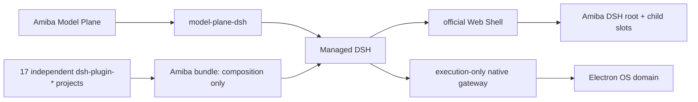

# Amiba → DSH 迁移审计

更新：2026-08-16  
基线：DeepSeek Harness `0.1.0-rc.6`。

## 当前结论

DSH 是唯一 Agent 内核。旧 Hermes backend、Extension Host、Managed Extensions、
Extension WebView preload/runner、私有插件 registry 和动态工具 catalog 均不在运行链路。

## 已验证的架构事实

| 项目 | 当前实现 |
| --- | --- |
| Agent 真源 | Session/Event/Context/Tools/Skills/MCP/Schedule 全部属于 DSH |
| Model Plane | Provider/Model/Credential 独立于 Harness，DSH 只消费投影 |
| Plugin 项目 | 17 个独立 `dsh-plugin-*`，Bundle 自动取 dependencies |
| UI root | `dsh-plugin-ui-shell` 通过官方 Slot service 注册唯一 root |
| Children slots | 12 个稳定 root slots；feature plugin 还可声明自己的嵌套 child slots |
| 插件清单 | Settings 读取 DSH 官方 Loader inventory Remote，无第二 registry |
| 外部插件 | 固定 pnpm 调用官方 `dsh plugin`；完整 profile 快照回滚，重启后重新读取 Host/Client graph |
| Electron | 保留 OS/UI transport、窄 native operation，以及不落业务状态的 chat presentation adapter |
| Browser tools | browser core 拥有契约；CLI/Web 使用 CDP provider，Electron 使用可见浏览器 provider |
| 作者入口 | SDK/CLI 生成标准 Host + Client DSH plugin，不生成 manifest/WebView |
| 旧系统 | Extension Host、Managed Extensions、runner、WebView bridge 已删除 |

## 当前插件集合

`catalog`、`runtime-gateway`、`runtime-inventory`、`ui-shell`、`model-plane`、`memory`、
`attachments`、`skills`、`mcp-manager`、`messaging-core`、
`messaging-channel-webhook`、`commands-adapter`、`schedule-adapter`、
`browser-core`、`browser-provider-cdp`、`browser-provider-electron`、`usage`。

其中 messaging channel 依赖 messaging core；MCP UI 依赖 Tools section 的 child slot；
browser provider 依赖 browser core，Electron provider 再依赖 runtime gateway；CDP
provider 不依赖 Electron。依赖方向均由插件 graph 表达。

## 代码门禁

`pnpm verify:architecture` 当前校验：

- Bundle 插件集合、命名、独立目录、README 与 Cordis export；
- root 与全部 children slot；
- Desktop 不 import plugin implementation；
- Electron native gateway 不出现 catalog/schema/tool registry；
- 外部插件管理只能调用官方 profile 命令，必须校验 bundle、dump config 并具备完整回滚；
- app-runtime 不导出或包含旧 extension-host/managed-extensions/mcp runtime；
- 插件脚手架使用官方 `slots.inject/register`；
- Model Plane 不依赖 DSH adapter 或 DeepSeek 包。

本文件不再声称一次历史验证永远有效。发布前必须重新运行 typecheck、tests、runtime
rebuild/verify/smoke 与 desktop build，并以当次命令输出为准。
