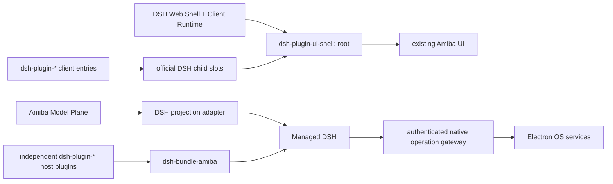

# Amiba 的 DSH 原生架构

日期：2026-08-16  
状态：破坏性迁移持续实施；本文是当前架构约束。

## 1. 结论

Electron 可以完整使用 DSH 的 Host Plugin、Client Plugin 与 UI Slots。Electron
renderer 仍是浏览器 DOM；区别只在于 Web Shell 由本地受管 DSH 提供，而不是部署在普通
Web 服务器。Amiba 不再保留自己的 Extension Host、插件 registry、manifest WebView 或
Managed Extensions runtime。

最终只有一条插件链路：

## 2. 不可破坏的所有权

1. DSH 是 Agent、Session、Event、Context、Model Binding、Preset、Tool、Approval、
   Question、Skill、MCP 与 Schedule 的唯一运行时真源。
2. Provider、Model、Credential 是先于 Harness 的 Amiba Model Plane；DSH 只消费执行
   投影，不能反向成为产品模型目录。
3. 需要 Agent 生命周期的能力必须是独立 `dsh-plugin-*` 项目。Bundle 只负责排序与
   配置，不包含功能实现。
4. UI contribution 必须由 DSH Client Plugin 通过官方 `slots.inject/register` 注册和
   卸载。Electron/React 不能枚举插件或保存第二份 UI contribution registry。
5. Electron 只实现必须在主进程完成的窄 OS 操作。模型可见的名字、schema、描述、
   provenance 和 lifecycle 全部属于调用它的 DSH plugin。
6. 不保留 Hermes、旧 Extension Host、旧 WebView bridge、旧 managed extension、会话
   双写或静默 fallback。
7. `@amiba/app-runtime/dsh-distribution` 是三种产品表面的 Bundle/Profile 组合契约；
   `@amiba/app-runtime/dsh-runtime` 是 Node、DSH、pnpm、路径、准备与校验的唯一可执行分发。
   CLI、Web、Electron 都只能消费它，Desktop 不拥有私有 Runtime。

## 3. Electron 如何承载 DSH Web Shell

启动顺序如下：

1. Electron main 启动仅绑定 `127.0.0.1` 的受管 DSH，并通过一次性 token 保护请求。
2. preload 暴露 DSH transport、普通桌面能力，以及一个只允许调用官方 profile plugin
   命令的安装边界；它不提供插件发现、注册或 UI contribution API。
3. renderer 请求 DSH client graph，加载官方 Web Shell 的 styles/scripts。
4. `@amiba/dsh-plugin-ui-shell` 通过官方 Slot service 注册唯一 `root`。
5. root 输出 `#amiba-dsh-root-container`，现有 Amiba React App 挂载到该容器。
6. feature Client Plugins 注册到 root 声明的 children slots；root plugin 把 contribution
   portal 到现有 UI 的语义锚点。

DOM 锚点只描述“这个视觉位置在哪里”，不描述“有哪些插件”。插件清单、排序、作用域、
注入、卸载仍来自 DSH Slot ledger。因此这不是 Desktop Host 反向提供 plugin。

Electron 的 `webviewTag` 仅用于 Amiba 内置可见浏览器，main 会拒绝任何不是
`persist:amiba-browser` partition 的 WebView attachment。DSH Client Plugin 自身不使用
Electron WebView，也没有 preload 特权。

## 4. Root children slots

当前公共契约由 `@amiba/extension-sdk` 导出，root 声明：

- `amiba.navigation.before`
- `amiba.navigation.after`
- `amiba.workspace.navigation`
- `amiba.workspace.view`
- `amiba.chat.header.after`
- `amiba.chat.content.overlay`
- `amiba.settings.navigation.before`
- `amiba.settings.navigation.assistant`
- `amiba.settings.navigation.after`
- `amiba.settings.section`
- `amiba.settings.content.overlay`
- `amiba.shell.overlay`

`workspace.navigation` 注入 `openWorkspace(viewId)`；`workspace.view` 与
`settings.section` 使用官方 list-slot ledger，并按 entry `id` 选择对应 contribution。
设置导航本身也是 ledger 的实时投影，不包含硬编码插件列表。

DSH 的 children 并不限于官方预定义位置。任何注册了 UI entry 的 Client Plugin 都可以在
自己的 `children` 字段继续声明更深的 slot。Amiba 已使用这一模式：Tools 设置 section
声明 `amiba.tools.panel`，MCP manager 再作为其 child contribution 注入。新增 slot 的原则
是语义稳定、归属清晰、具备实际扩展需求，不能为单个临时组件制造全局 API。

## 5. 插件项目与依赖

仓库物理边界固定为四个根级目录：`apps/` 放产品入口，`packages/` 放普通共享库与公共
App Runtime，
`plugins/` 只放独立 `dsh-plugin-*` 功能工程，`bundles/` 只放
`dsh-bundle-amiba-*` Profile 装配工程。插件与 Bundle 不能再回到 `packages/`；目录归属由
`pnpm-workspace.yaml`、受管运行时发现脚本和 `verify:architecture` 共同校验。

每个功能模块是独立项目并以 `dsh-plugin-` 开头。当前 Bundle 组装 17 个 Amiba 插件：

- UI shell、runtime inventory、capability catalog；
- memory、attachments、skills、MCP manager；
- messaging core 与 webhook channel provider；
- commands adapter、schedule adapter；
- usage；
- browser core、CDP provider、Electron provider 与 runtime gateway。

插件之间通过 npm dependency、DSH client graph 与 Cordis service injection 显式依赖。
例如 webhook channel 依赖 messaging core；MCP manager 的 UI 依赖 Tools section 提供的
child slot。不得把所有能力重新合并到一个“超级插件”。

`@amiba/extension-sdk` 是 DSH 插件作者契约：Host/Client 类型帮助器、稳定 slot 名称、
SlotMap augmentation，以及可选的 Amiba 原生边界类型。它不实现 Electron、不保存
registry、不定义自定义 manifest，也不拥有另一套生命周期。`amiba plugin create` 生成标准
Host + Client DSH plugin，并演示通过官方 slot API 注入
`amiba.chat.header.after`。

## 6. Native gateway

`dsh-plugin-browser-core` 在 DSH 内拥有 8 个浏览器工具的 schema、attachment 归一化、
provenance 和动态生命周期。只有至少一个 provider 存活时才注册这些工具。
`dsh-plugin-browser-provider-cdp` 为 CLI/Web 连接标准 Chrome DevTools Protocol；
`dsh-plugin-browser-provider-electron` 通过 `dsh-plugin-runtime-gateway` 使用可见的内嵌
浏览器。Electron gateway 仍只有 `/health` 与 `/call`：

- 随机高熵 bearer token；
- 只绑定回环地址；
- 固定大小的 JSON body；
- 操作 allowlist；
- 没有 `/catalog`、动态 tool schema、plugin inventory 或 UI contribution。

若后续插件需要文件选择、Keychain、通知等主进程能力，应新增独立 DSH plugin 并在
gateway 增加对应窄 operation；不能把 schema 或生命周期移回 Electron。

## 7. 功能归属

| 能力 | 归属 |
| --- | --- |
| Agent/Session/Event/Tools/Skills/MCP/Schedule | DSH 官方运行时 |
| Provider/Model/Credential | Amiba Model Plane；DSH adapter 只投影 |
| 长期跨 Session 记忆 | `dsh-plugin-memory` |
| 消息路由与耐久性 | `dsh-plugin-messaging-core` |
| 具体消息渠道 | 独立 `dsh-plugin-messaging-channel-*` |
| 工具目录与 provenance | DSH ToolRuntime + `dsh-plugin-catalog` |
| Token 用量 | `dsh-plugin-usage`，从 `ctx.sessionQuery` 规范日志派生 |
| 插件运行清单 | DSH Loader inventory Remote |
| 外部插件安装 | `dsh-plugin-runtime-inventory` Client UX + Electron 停机执行官方 `dsh plugin`；DSH Profile/Loader 仍是真源 |
| 浏览器 tools | `dsh-plugin-browser-core`；CDP 与 Electron 是并列 provider 插件 |
| UI root/children | `dsh-plugin-ui-shell` + feature Client Plugins |
| 窗口、快捷键、通知、PTY、Workspace | Electron OS domain |
| Chat 流映射与桌面通知 | Electron presentation adapter；不拥有 Session/Event 持久化 |

Voice/STT、Kanban/Task Center、虚拟模型编排、独立浏览器扩展产品、Python gateway、旧
Extension/Managed Extension 系统均已砍掉。需要重新引入的 Agent 能力必须重新设计为
独立 DSH plugin。

## 8. 验收门槛

- `pnpm verify:architecture`：禁止 Desktop plugin imports、旧 Extension runtime、
  gateway catalog/schema，并校验全部独立插件及 slots。
- `pnpm -r typecheck` 与 `pnpm -r --if-present test`。
- `pnpm runtime:rebuild && pnpm runtime:verify`：受管 DSH 必须绑定当前插件源码摘要。
- `pnpm runtime:smoke`：真实验证 Session、Tools、Memory、Messaging、MCP、Schedule、
  Usage、plugin inventory 与外部 bundle 的 Host/Client graph。
- `pnpm build:desktop`：只生成 main preload 与 renderer，不再生成 Extension runner 或
  WebView bridge preload。
