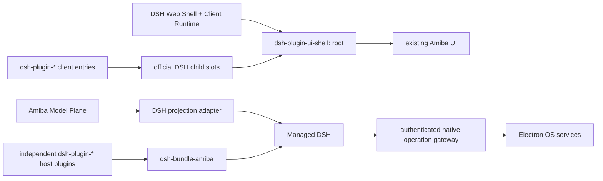

# Amiba 的 DSH 原生架构

日期：2026-08-16  
状态：破坏性迁移持续实施；本文是当前架构约束。

## 1. 结论

Electron 可以完整使用 DSH 的 Host Plugin、Client Plugin 与 UI Slots。Electron
renderer 仍是浏览器 DOM；区别只在于 Web Shell 由本地受管 DSH 提供，而不是部署在普通
Web 服务器。Amiba 不再保留自己的 Extension Host、插件 registry、manifest WebView 或
Managed Extensions runtime。

最终只有一条插件链路：

## 2. 不可破坏的所有权

1. DSH 是 Agent、Session、Event、Context、Model Binding、Preset、Tool、Approval、
   Question、Skill、MCP 与 Schedule 的唯一运行时真源。
2. Provider、Model、Credential 是先于 Harness 的 Amiba Model Plane；DSH 只消费执行
   投影，不能反向成为产品模型目录。
3. 需要 Agent 生命周期的能力必须是独立 `dsh-plugin-*` 项目。Bundle 只负责排序与
   配置，不包含功能实现。
4. UI contribution 必须由 DSH Client Plugin 通过官方 `slots.inject/register` 注册和
   卸载。Electron/React 不能枚举插件或保存第二份 UI contribution registry。
5. Electron 只实现必须在主进程完成的窄 OS 操作。模型可见的名字、schema、描述、
   provenance 和 lifecycle 全部属于调用它的 DSH plugin。
6. 不保留 Hermes、旧 Extension Host、旧 WebView bridge、旧 managed extension、会话
   双写或静默 fallback。
7. `@amiba/app-runtime/dsh-distribution` 是三种产品表面的 Bundle/Profile 组合契约；
   `@amiba/app-runtime/dsh-runtime` 是 Node、DSH、pnpm、路径、准备与校验的唯一可执行分发。
   CLI、Web、Electron 都只能消费它，Desktop 不拥有私有 Runtime。

## 3. Electron 如何承载 DSH Web Shell

启动顺序如下：

1. Electron main 启动仅绑定 `127.0.0.1` 的受管 DSH，并通过一次性 token 保护请求。
2. preload 暴露 DSH transport、普通桌面能力，以及一个只允许调用官方 profile plugin
   命令的安装边界；它不提供插件发现、注册或 UI contribution API。
3. renderer 请求 DSH client graph，加载官方 Web Shell 的 styles/scripts。
4. `@amiba/dsh-plugin-ui-shell` 通过官方 Slot service 注册唯一 `root`。
5. root 组件（AmibaRoot）自己构造 Amiba 产品 Shell，整个产品运行在官方 Web Shell 的
   同一棵 React 树里，没有第二个 React root。
6. feature Client Plugins 注册到声明的 children slots；产品 Shell 把官方 `renderSlot`
   作为 render prop 向下传递，contribution 直接在语义位置就地渲染（`only` 过滤按
   entry id 选择）。没有 DOM marker 扫描、没有 portal 侧信道；唯一保留的
   `data-amiba-dsh-*` attribute 是 `data-amiba-dsh-base-url`（renderer 启动契约，
   由 messaging-core 读取）。

渲染位置由 render prop 的调用点决定，不描述“有哪些插件”。插件清单、排序、作用域、
注入、卸载仍来自 DSH Slot ledger。因此这不是 Desktop Host 反向提供 plugin。

Electron 的 `webviewTag` 仅用于 Amiba 内置可见浏览器，main 会拒绝任何不是
`persist:amiba-browser` partition 的 WebView attachment。DSH Client Plugin 自身不使用
Electron WebView，也没有 preload 特权。

## 4. Root children slots

当前公共契约由 `@amiba/extension-sdk` 导出（其中 `amiba.agentPreset.section`
的运行时声明在 dsh-plugin-agent-preset 自己的 settings section entry 上）。

词汇表策略：有官方等价物的 seat 使用官方 slot 名并继承官方契约 ——
`settings.section`（owner `SettingsSectionOwnerProps { close }`）类型来自
`@deepseek-ai/dsh-client-ui-settings`，`shell.overlay` 来自
`@deepseek-ai/dsh-client-ui-layout`，`conversation.session.header.utilities`
与 `conversation.input.model` 来自
`@deepseek-ai/dsh-client-ui-conversation`（session scope 的官方 seat 依赖
ui-shell 的 sessions bridge 把官方 `ctx.sessions` 选中态与 Amiba 自己的
activeId 保持同步），`tool.call.toolview` 来自
`@deepseek-ai/dsh-client-ui-tool`；`amiba.*` 前缀只用于没有官方对应位的 vendor
扩展。
root 声明：

- `amiba.navigation.before`
- `amiba.navigation.after`
- `amiba.workspace.navigation`
- `amiba.workspace.view`
- `conversation.session.header.utilities`（官方名，list，session scope，空
  owner；取代已退役的 `amiba.chat.header.after` —— 无会话时该 seat 渲染为空）
- `conversation.session.header.actions`（官方名，list，session scope，空
  owner；标题旁的 per-session action row。Amiba 原本没有这个区域，P3 新建的
  行在 seat 为空时整行 `empty:hidden` 折叠，不占 box 也不占 flex gap）
- `amiba.chat.content.overlay`
- `amiba.composer.modelPicker`（session-less hero model seat，composer 无会话
  时经 render prop 派发）
- `conversation.input.model`（官方名，single，session scope，owner
  `{ locked }`；composer 有会话时经同一 render prop 派发）
- `conversation.input.plan`（官方名，single，session scope，owner
  `{ locked }`；位于 composer tool row 中 access-mode 控件的紧右侧，与官方契约
  一致。Amiba 目前没有占位者——官方 ui-plan 未启用——空 seat 不渲染任何东西）
- `settings.section`（官方名；registrant 可用 vendor 约定 `navIcon` inject
  face 提供导航图标，官方插件没有图标时回退到通用 Blocks 图标）
- `amiba.settings.content.overlay`
- `amiba.agentPreset.section`
- `shell.overlay`（官方名）
- `tool.call.toolview`（官方名，来自 `@deepseek-ai/dsh-client-ui-tool`，**keyed**，
  session scope，owner `ToolCallOwnerProps`）。root children 里唯一的 keyed
  seat：key 就是**线上工具名**，域是开放的，所以插件用
  `key: "<wire tool name>"` 注册即可接管这个工具在 turn 里的调用行。没有插件
  认领的名字渲染 Amiba 自己那张 `ToolSpec` 工具行 —— shell 把它作为 dispatch
  的 `fallback` 传下去，所以没有任何插件注册时会话与采纳前逐字节一致

Phase-2 记录的诚实裁剪：继承 ui-conversation 类型后，session 标准 kit 的
`useInput`/`inputActions` 成员在类型上可见，但 Amiba 运行时没有 ui-conversation
的 input machine，也没有为它注册 `sessions.provide` bundle —— 这两个成员运行时
为 `undefined`（Phase 4 项）。框架成员 `sessionId`/`useSession`/`useProjection`
由 dsh-client-runtime 直接提供，可用。

`tool.call.toolview` 的采纳记录（这个席位曾在 Phase-3 被延后，理由是"有工作量"
而非结构性做不到；后续复核确认了成本，现已采纳）。忠实提供官方 owner 是采纳的
前提，逐成员对账：

| 官方成员 | Amiba 来源 | 怎么带过去 |
| --- | --- | --- |
| `callId` | `ToolProgress.toolCallId` | 结果侧即 `message.source.callId`，无转换 |
| `toolName` | 由 block 派生 | 与官方 `callName` 完全一致：settled 取 `block.call?.name ?? ""`，running 取 `block.name`；同时作为 dispatch 的 `entryKey` |
| `block` | `ToolProgress.wire` | 两个 producer（reload 投影 + live mux bridge）都无损保留了原始 `tool/call`/`tool/result` 材料，渲染位按官方 `rootCall`/`rootResult` 逐字段重建 |
| `cwd` | 会话的 workspace 绑定 | `platform.workspaces.getCurrent(sessionId)`，与 composer / workspace pane 读的是同一个 |
| `openFile` | workspace pane 的 `openFile(path)` | Amiba 工具行本来就走这条打开路径 |
| `inspect` | —— | **故意不提供**（成员是可选的）：它的语义是"在 trajectory 视图里检视这次调用"，而 Amiba 的 web bundle 禁用了官方 `ui-trajectory` 且没有等价物。Amiba 自己的两个行内affordance 都不是它：workspace pane 打开的是工具的**资源**（文件/终端/浏览器），内联详情折叠属于占位者要替换掉的那一行本身 |

`subCalls: []` 在这里是**忠实值而非占位**：官方 builder 对每个 ROOT 调用也发
`[]`，子调用只来自 `tool/code-dispatch-start`/`tool/code-dispatch`。这两类事件
只在 Code Mode 下产生，而 Code Mode 的 `run_code` transport 需要挂载
`ctx.codeRuntime`；Amiba 的 bundle 没有组装任何 code runtime、也没有插件申请，
所以 Amiba 自己组装出的会话不会产生这两类事件，每个调用都是根调用。这句话的
适用范围就是 Amiba 自己的 composition：受管 profile 的 `cordis.patch.yml` 归用户
所有（只在缺失时种一次，之后永不覆写），运维者若在那里挂一个 code runtime 并
选用 code preset，这两类事件是会流动的 —— 但 Amiba 自己的工具行本来也从不展示
子调用，所以那种配置相对采纳前没有任何回退，只是不在这句 `[]` 的承诺范围内。

第三方占位者的前置条件（记录一次）：上游自己的 toolview 注册带
`locale: CONVERSATION_NS`，而缺少官方 `locale` 行时，任何带 locale 命名空间的注册
都会在渲染边界外抛 `SlotAssemblyError`。所以照上游模式写的 `tool.call.toolview`
占位插件，依赖 web bundle 保留 `locale` 行（见该 bundle patch 头部说明）才能激活。

声明锚点（declaration anchor）的偏差，只有这一个席位有：官方是从
`conversation.chat.node` 的 `tool-call` entry 声明它的（那个 Chat Node 拥有整棵
调用树），Amiba 没有对应 entry —— 它的会话是自己的投影。因此这个席位声明在
Amiba 自己的 root children table 上，与已采纳的 `conversation.*` 席位同一套做法。
只有**声明位置**不同，key / kind / scope / owner 契约都是官方的。

视觉零回归是硬要求：没有插件注册时，每个工具行渲染的就是今天那张 `ToolSpec`
工具行 —— shell 把它当 dispatch 的 `fallback` 传下去。`entryKey` 与 `fallback`
两个选项都是承重的（缺前者 keyed 永远匹配不上，缺后者未认领的工具会渲染成空），
`verify:architecture` 分别 pin 住。没有插件运行时的 surface（Quick-Ask）不传
render prop，走同一张 fallback 行。

Phase-3 记录的诚实裁剪（采用官方名的前提是能忠实提供官方 owner 契约，否则宁可
不采用——用官方名配一个走样的 owner，比继续用 vendor 名更糟）：

- `conversation.input.dock` / `.composer.dock` / `.input.left` / `.input.right`：
  owner 是 `InputZone { session: ConversationSnapshot; input: InputState }`。
  **记录纠正**：它们**不**依赖 `ctx.sessions.provide` —— `InputZone` 是 owner
  share，由 Amiba 自己的 dispatch 点传入（`conversation.input.plan` 的
  `{ locked }` 就是这么传的），而且席位契约明确要求占位者读 owner share、
  不要订阅 `useInput`。`session` 现成可得（`ctx.sessions.binding(id)`；官方
  ConversationSnapshot 在这里是真值，其 `views`/`chat`/`nodes` 就是"没有注册
  view Definition 的 composition"官方定义的空值）。真正的卡点是 `InputState`
  的两个成员：`occurrences`（每条必须精确对应草稿里一个 U+FFFC 占位符，而
  Amiba 的 MentionNode 投的是多字符 token，忠实化意味着把该 token 移到剪贴板／
  模型投影并维护侧表）与 `imageIds`（浏览器自有的未发送草稿 id；Amiba 的附件
  是宿主暂存的，需要在其前面加一层自有 id 空间）。`draftRev` 与收窄后的
  `phase` 随之免费得到。
  另外单独一条，且在上游拆分接口之前是**永久性**的：`useInput`/`inputActions`
  的忠实 `sessions.provide` 供给**不可能** —— `InputActions` 五个成员里三个
  （`addImages`/`removeImage`/`pruneImages`）经手的 `DraftAttachmentId` 由
  `conversation` 服务铸造与解析，而那个服务名 Amiba 不该拿（它捆着
  send/cancel/loadOlder/updateQueue/resolveImage，每一项 Amiba 都用自己的引擎
  另行实现）。
- `conversation.chat.turnTail`：owner 的 `turn: TurnLocation` 是 engine-owned
  边界，携带原始 `turn/start`/`turn/end` 事件、`StepLocation[]` 与业务数据
  reader，Amiba 的投影三样都没有保留。
- `conversation.chat.assistant-actions`：`messageId: MessageId` 线上有（Amiba 自己
  的 user 消息分支就在读 `message.id`），且只有 finalized 消息会进这个席位——真正
  的卡点在渲染位：Amiba 把一个 turn 的所有 `assistant/message` 折成一个气泡，N 个
  模型步就有 N 个 MessageId 却只有一条操作行，任选其一都是武断。采纳前提是按消息
  拆气泡，与协议无关。

曾经的 `amiba.settings.navigation.before/assistant/after` 三个 slot 已退役：
before/after 从无注册者；assistant 的 ledger 导航组件改由产品 Shell 直接渲染
（组件与 ledger source 本就归 ui-shell 所有，slot 间接层没有价值）。

`workspace.navigation` 注入 `openWorkspace(viewId)`；`workspace.view` 与
`settings.section` 使用官方 list-slot ledger，并按 entry `id` 选择对应 contribution。
设置导航本身也是 ledger 的实时投影，不包含硬编码插件列表。

DSH 的 children 并不限于官方预定义位置。任何注册了 UI entry 的 Client Plugin 都可以在
自己的 `children` 字段继续声明更深的 slot。Amiba 已使用这一模式：Tools 设置 section
声明 `amiba.tools.panel`，MCP manager 再作为其 child contribution 注入；agent-preset
section 声明 `amiba.agentPreset.section`，catalog/memory/skills 注入各自的预设详情
tab。新增 slot 的原则是语义稳定、归属清晰、具备实际扩展需求，不能为单个临时组件制造
全局 API。

## 5. 插件项目与依赖

仓库物理边界固定为四个根级目录：`apps/` 放产品入口，`packages/` 放普通共享库与公共
App Runtime，
`plugins/` 只放独立 `dsh-plugin-*` 功能工程，`bundles/` 只放
`dsh-bundle-amiba-*` Profile 装配工程。插件与 Bundle 不能再回到 `packages/`；目录归属由
`pnpm-workspace.yaml`、受管运行时发现脚本和 `verify:architecture` 共同校验。

每个功能模块是独立项目并以 `dsh-plugin-` 开头。当前 Bundle 组装 17 个 Amiba 插件：

- UI shell、runtime inventory、capability catalog；
- memory、attachments、skills、MCP manager；
- messaging core 与 webhook channel provider；
- commands adapter、schedule adapter；
- usage；
- browser core、CDP provider、Electron provider 与 runtime gateway。

插件之间通过 npm dependency、DSH client graph 与 Cordis service injection 显式依赖。
例如 webhook channel 依赖 messaging core；MCP manager 的 UI 依赖 Tools section 提供的
child slot。不得把所有能力重新合并到一个“超级插件”。

`@amiba/extension-sdk` 是 DSH 插件作者契约：Host/Client 类型帮助器、稳定 slot 名称、
SlotMap augmentation，以及可选的 Amiba 原生边界类型。它不实现 Electron、不保存
registry、不定义自定义 manifest，也不拥有另一套生命周期。`amiba plugin create` 生成标准
Host + Client DSH plugin，并演示通过官方 slot API 注入
`conversation.session.header.utilities`。

## 6. Native gateway

`dsh-plugin-browser-core` 在 DSH 内拥有 8 个浏览器工具的 schema、attachment 归一化、
provenance 和动态生命周期。只有至少一个 provider 存活时才注册这些工具。
`dsh-plugin-browser-provider-cdp` 为 CLI/Web 连接标准 Chrome DevTools Protocol；
`dsh-plugin-browser-provider-electron` 通过 `dsh-plugin-runtime-gateway` 使用可见的内嵌
浏览器。Electron gateway 仍只有 `/health` 与 `/call`：

- 随机高熵 bearer token；
- 只绑定回环地址；
- 固定大小的 JSON body；
- 操作 allowlist；
- 没有 `/catalog`、动态 tool schema、plugin inventory 或 UI contribution。

若后续插件需要文件选择、Keychain、通知等主进程能力，应新增独立 DSH plugin 并在
gateway 增加对应窄 operation；不能把 schema 或生命周期移回 Electron。

## 7. 功能归属

| 能力 | 归属 |
| --- | --- |
| Agent/Session/Event/Tools/Skills/MCP/Schedule | DSH 官方运行时 |
| Provider/Model/Credential | Amiba Model Plane；DSH adapter 只投影 |
| 长期跨 Session 记忆 | `dsh-plugin-memory` |
| 消息路由与耐久性 | `dsh-plugin-messaging-core` |
| 具体消息渠道 | 独立 `dsh-plugin-messaging-channel-*` |
| 工具目录与 provenance | DSH ToolRuntime + `dsh-plugin-catalog` |
| Token 用量 | `dsh-plugin-usage`，从 `ctx.sessionQuery` 规范日志派生 |
| 插件运行清单 | DSH Loader inventory Remote |
| 外部插件安装 | `dsh-plugin-runtime-inventory` Client UX + Electron 停机执行官方 `dsh plugin`；DSH Profile/Loader 仍是真源 |
| 浏览器 tools | `dsh-plugin-browser-core`；CDP 与 Electron 是并列 provider 插件 |
| UI root/children | `dsh-plugin-ui-shell` + feature Client Plugins |
| 窗口、快捷键、通知、PTY、Workspace | Electron OS domain |
| Chat 流映射与桌面通知 | Electron presentation adapter；不拥有 Session/Event 持久化 |

Voice/STT、Kanban/Task Center、虚拟模型编排、独立浏览器扩展产品、Python gateway、旧
Extension/Managed Extension 系统均已砍掉。需要重新引入的 Agent 能力必须重新设计为
独立 DSH plugin。

## 8. 验收门槛

- `pnpm verify:architecture`：禁止 Desktop plugin imports、旧 Extension runtime、
  gateway catalog/schema，并校验全部独立插件及 slots。
- `pnpm -r typecheck` 与 `pnpm -r --if-present test`。
- `pnpm runtime:rebuild && pnpm runtime:verify`：受管 DSH 必须绑定当前插件源码摘要。
- `pnpm runtime:smoke`：真实验证 Session、Tools、Memory、Messaging、MCP、Schedule、
  Usage、plugin inventory 与外部 bundle 的 Host/Client graph。
- `pnpm build:desktop`：只生成 main preload 与 renderer，不再生成 Extension runner 或
  WebView bridge preload。
