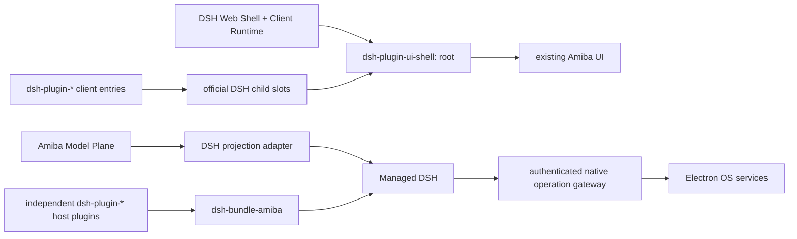

# Amiba 的 DSH 原生架构

日期：2026-08-16  
状态：破坏性迁移持续实施；本文是当前架构约束。

## 1. 结论

Electron 可以完整使用 DSH 的 Host Plugin、Client Plugin 与 UI Slots。Electron
renderer 仍是浏览器 DOM；区别只在于 Web Shell 由本地受管 DSH 提供，而不是部署在普通
Web 服务器。Amiba 不再保留自己的 Extension Host、插件 registry、manifest WebView 或
Managed Extensions runtime。

最终只有一条插件链路：

## 2. 不可破坏的所有权

1. DSH 是 Agent、Session、Event、Context、Model Binding、Preset、Tool、Approval、
   Question、Skill、MCP 与 Schedule 的唯一运行时真源。
2. Provider、Model、Credential 是先于 Harness 的 Amiba Model Plane；DSH 只消费执行
   投影，不能反向成为产品模型目录。
3. 需要 Agent 生命周期的能力必须是独立 `dsh-plugin-*` 项目。Bundle 只负责排序与
   配置，不包含功能实现。
4. UI contribution 必须由 DSH Client Plugin 通过官方 `slots.inject/register` 注册和
   卸载。Electron/React 不能枚举插件或保存第二份 UI contribution registry。
5. Electron 只实现必须在主进程完成的窄 OS 操作。模型可见的名字、schema、描述、
   provenance 和 lifecycle 全部属于调用它的 DSH plugin。
6. 不保留 Hermes、旧 Extension Host、旧 WebView bridge、旧 managed extension、会话
   双写或静默 fallback。
7. `@amiba/app-runtime/dsh-distribution` 是三种产品表面的 Bundle/Profile 组合契约；
   `@amiba/app-runtime/dsh-runtime` 是 Node、DSH、pnpm、路径、准备与校验的唯一可执行分发。
   CLI、Web、Electron 都只能消费它，Desktop 不拥有私有 Runtime。

## 3. Electron 如何承载 DSH Web Shell

启动顺序如下：

1. Electron main 启动仅绑定 `127.0.0.1` 的受管 DSH，并通过一次性 token 保护请求。
2. preload 暴露 DSH transport、普通桌面能力，以及一个只允许调用官方 profile plugin
   命令的安装边界；它不提供插件发现、注册或 UI contribution API。
3. renderer 请求 DSH client graph，加载官方 Web Shell 的 styles/scripts。
4. `@amiba/dsh-plugin-ui-shell` 通过官方 Slot service 注册唯一 `root`。
5. root 组件（AmibaRoot）自己构造 Amiba 产品 Shell，整个产品运行在官方 Web Shell 的
   同一棵 React 树里，没有第二个 React root。
6. feature Client Plugins 注册到声明的 children slots；产品 Shell 把官方 `renderSlot`
   作为 render prop 向下传递，contribution 直接在语义位置就地渲染（`only` 过滤按
   entry id 选择）。没有 DOM marker 扫描、没有 portal 侧信道；唯一保留的
   `data-amiba-dsh-*` attribute 是 `data-amiba-dsh-base-url`（renderer 启动契约，
   由 messaging-core 读取）。

渲染位置由 render prop 的调用点决定，不描述“有哪些插件”。插件清单、排序、作用域、
注入、卸载仍来自 DSH Slot ledger。因此这不是 Desktop Host 反向提供 plugin。

Electron 的 `webviewTag` 仅用于 Amiba 内置可见浏览器，main 会拒绝任何不是
`persist:amiba-browser` partition 的 WebView attachment。DSH Client Plugin 自身不使用
Electron WebView，也没有 preload 特权。

## 4. Root children slots

当前公共契约由 `@amiba/extension-sdk` 导出（其中 `amiba.agentPreset.section`
的运行时声明在 dsh-plugin-agent-preset 自己的 settings section entry 上）。

词汇表策略：有官方等价物的 seat 使用官方 slot 名并继承官方契约 ——
`settings.*` 家族（八个官方名里采纳了七个）类型来自
`@deepseek-ai/dsh-client-ui-settings`，`shell.overlay` 来自
`@deepseek-ai/dsh-client-ui-layout`，`conversation.session.header.utilities`
与 `conversation.input.model` 来自
`@deepseek-ai/dsh-client-ui-conversation`（session scope 的官方 seat 依赖
ui-shell 的 sessions bridge 把官方 `ctx.sessions` 选中态与 Amiba 自己的
activeId 保持同步），`tool.call.toolview` 来自
`@deepseek-ai/dsh-client-ui-tool`，`conversation.input.overlay` 来自
`@deepseek-ai/dsh-client-ui-input-trigger`；`amiba.*` 前缀只用于没有官方对应位的
vendor 扩展。
root 声明：

- `amiba.navigation.before`
- `amiba.navigation.after`
- `amiba.workspace.navigation`
- `amiba.workspace.view`
- `conversation.session.header.utilities`（官方名，list，session scope，空
  owner；取代已退役的 `amiba.chat.header.after` —— 无会话时该 seat 渲染为空）
- `conversation.session.header.actions`（官方名，list，session scope，空
  owner；标题旁的 per-session action row。Amiba 原本没有这个区域，P3 新建的
  行在 seat 为空时整行 `empty:hidden` 折叠，不占 box 也不占 flex gap）
- `amiba.chat.content.overlay`
- `amiba.composer.modelPicker`（session-less hero model seat，composer 无会话
  时经 render prop 派发）
- `conversation.input.model`（官方名，single，session scope，owner
  `{ locked }`；composer 有会话时经同一 render prop 派发）
- `conversation.input.plan`（官方名，single，session scope，owner
  `{ locked }`；位于 composer tool row 中 access-mode 控件的紧右侧，与官方契约
  一致。Amiba 目前没有占位者——官方 ui-plan 未启用——空 seat 不渲染任何东西）
- `conversation.input.overlay`（官方名，来自
  `@deepseek-ai/dsh-client-ui-input-trigger`，list，session scope，**owner 为
  空**）。composer 的浮层锚点：官方那边 `/` 命令弹窗与 `@` 候选菜单都渲染在
  这里。owner 为空是"声明本身就是空"而不是 Amiba 少给了东西 —— 官方 SlotMap
  条目没有 `owner` 字段，占位者读自己的 store、关闭时渲染 `null`，所以
  `renderSlot("conversation.input.overlay", {})` 是唯一忠实的派发（与上游
  ui-conversation composer entry 的派发逐字一致）。
  渲染点：`@amiba/ui` 的 Composer 卡片内，作为 `[data-composer-card]` 这个
  frame 的最后一个子节点，**裸派发、不包 wrapper**。锚点的两半都是契约不是装饰
  —— 占位者用 `position: absolute; bottom: calc(100% + 4px)` 相对这张卡片定位，
  并对自己调用 `closest("[data-composer-card]")` 来区分"点在 composer 里"和
  "点在外面"（后者才关闭浮层）；wrapper 会抢走定位祖先的角色，也会让空 seat 占
  box。Quick-Ask 等没有插件运行时的界面不传 renderer，逐字节不变。
  **占位情况（Phase-4.3 完成后）**：`ui-input-trigger` 与 `ui-commands` 都已启用，
  两个官方 entry 都会注册进来；amiba-ui-shell 以**相同 `id`**（`slash-menu`、
  `command-popup`）+ `priority: -1` 注册自己的组件把它们**遮蔽**掉，每个 cell
  恰好渲染一个且是 Amiba 的。服务不被遮蔽 —— 详见 §4.1
- `settings.section`（官方名，list，root scope，owner
  `SettingsSectionOwnerProps { close }`；registrant 可用 vendor 约定 `navIcon`
  inject face 提供导航图标，官方插件没有图标时回退到通用 Blocks 图标）
- `settings.trigger`（官方名，**single**，root scope，owner
  `{ wide }`）。侧边栏"设置"行的内容。`wide` 是侧边栏栏宽状态，Amiba 自己知道
  （collapsed 时为 false），所以这份 owner 是真值不是占位
- `settings.header`（官方名，**single**，root scope，空 owner）。设置导航顶部
  的标题文本 —— 对话框用 `aria-labelledby` 指向这个节点取名
- `settings.action`（官方名，list，root scope，空 owner）。页面 header 尾部、
  Close 之前的 shell 级操作。它与 Amiba 自己的
  `[data-settings-page-actions]` portal 容器**并存**：portal 是"页面自己在树内
  挂 header 控件"的通道，seat 是"插件注册一次、每页都在"的通道
- `settings.close`（官方名，**single**，root scope，空 owner）。关闭按钮的视觉
  隐藏标签
- `settings.onboarding`（官方名，list，root scope，owner
  `{ stepId, complete, openSection }`）。协调式而非叠加式：见 §4.2
- `settings.general.item`（官方名，list，root scope，空 owner）。General 分区
  （Amiba 的"外观"页）底部的偏好行，追加在产品自带的行之下。**这个席位上有一个
  真实占位者**：官方 `@deepseek-ai/dsh-client-locale` 在这里注册它自己的
  `LanguageRow`（`id: "language"`, `order: 0`）—— 也就是产品里唯一那一行"语言"，
  见 §4.4
- `amiba.settings.content.overlay`
- `amiba.agentPreset.section`
- `shell.overlay`（官方名）
- `tool.call.toolview`（官方名，来自 `@deepseek-ai/dsh-client-ui-tool`，**keyed**，
  session scope，owner `ToolCallOwnerProps`）。root children 里唯一的 keyed
  seat：key 就是**线上工具名**，域是开放的，所以插件用
  `key: "<wire tool name>"` 注册即可接管这个工具在 turn 里的调用行。没有插件
  认领的名字渲染 Amiba 自己那张 `ToolSpec` 工具行 —— shell 把它作为 dispatch
  的 `fallback` 传下去，所以没有任何插件注册时会话与采纳前逐字节一致

Phase-2 记录的诚实裁剪：继承 ui-conversation 类型后，session 标准 kit 的
`useInput`/`inputActions` 成员在类型上可见，但 Amiba 运行时没有 ui-conversation
的 input machine，也没有为它注册 `sessions.provide` bundle —— 这两个成员运行时
为 `undefined`（Phase 4 项）。框架成员 `sessionId`/`useSession`/`useProjection`
由 dsh-client-runtime 直接提供，可用。

`tool.call.toolview` 的采纳记录（这个席位曾在 Phase-3 被延后，理由是"有工作量"
而非结构性做不到；后续复核确认了成本，现已采纳）。忠实提供官方 owner 是采纳的
前提，逐成员对账：

| 官方成员 | Amiba 来源 | 怎么带过去 |
| --- | --- | --- |
| `callId` | `ToolProgress.toolCallId` | 结果侧即 `message.source.callId`，无转换 |
| `toolName` | 由 block 派生 | 与官方 `callName` 完全一致：settled 取 `block.call?.name ?? ""`，running 取 `block.name`；同时作为 dispatch 的 `entryKey` |
| `block` | `ToolProgress.wire` | 两个 producer（reload 投影 + live mux bridge）都无损保留了原始 `tool/call`/`tool/result` 材料，渲染位按官方 `rootCall`/`rootResult` 逐字段重建 |
| `cwd` | 会话的 workspace 绑定 | `platform.workspaces.getCurrent(sessionId)`，与 composer / workspace pane 读的是同一个 |
| `openFile` | workspace pane 的 `openFile(path)` | Amiba 工具行本来就走这条打开路径 |
| `inspect` | —— | **故意不提供**（成员是可选的）：它的语义是"在 trajectory 视图里检视这次调用"，而 Amiba 的 web bundle 禁用了官方 `ui-trajectory` 且没有等价物。Amiba 自己的两个行内affordance 都不是它：workspace pane 打开的是工具的**资源**（文件/终端/浏览器），内联详情折叠属于占位者要替换掉的那一行本身 |

`subCalls: []` 在这里是**忠实值而非占位**：官方 builder 对每个 ROOT 调用也发
`[]`，子调用只来自 `tool/code-dispatch-start`/`tool/code-dispatch`。这两类事件
只在 Code Mode 下产生，而 Code Mode 的 `run_code` transport 需要挂载
`ctx.codeRuntime`；Amiba 的 bundle 没有组装任何 code runtime、也没有插件申请，
所以 Amiba 自己组装出的会话不会产生这两类事件，每个调用都是根调用。这句话的
适用范围就是 Amiba 自己的 composition：受管 profile 的 `cordis.patch.yml` 归用户
所有（只在缺失时种一次，之后永不覆写），运维者若在那里挂一个 code runtime 并
选用 code preset，这两类事件是会流动的 —— 但 Amiba 自己的工具行本来也从不展示
子调用，所以那种配置相对采纳前没有任何回退，只是不在这句 `[]` 的承诺范围内。

第三方占位者的前置条件（记录一次）：上游自己的 toolview 注册带
`locale: CONVERSATION_NS`，而缺少官方 `locale` 行时，任何带 locale 命名空间的注册
都会在渲染边界外抛 `SlotAssemblyError`。所以照上游模式写的 `tool.call.toolview`
占位插件，依赖 web bundle 保留 `locale` 行（见该 bundle patch 头部说明）才能激活。

声明锚点（declaration anchor）的偏差，只有这一个席位有：官方是从
`conversation.chat.node` 的 `tool-call` entry 声明它的（那个 Chat Node 拥有整棵
调用树），Amiba 没有对应 entry —— 它的会话是自己的投影。因此这个席位声明在
Amiba 自己的 root children table 上，与已采纳的 `conversation.*` 席位同一套做法。
只有**声明位置**不同，key / kind / scope / owner 契约都是官方的。

视觉零回归是硬要求：没有插件注册时，每个工具行渲染的就是今天那张 `ToolSpec`
工具行 —— shell 把它当 dispatch 的 `fallback` 传下去。`entryKey` 与 `fallback`
两个选项都是承重的（缺前者 keyed 永远匹配不上，缺后者未认领的工具会渲染成空），
`verify:architecture` 分别 pin 住。没有插件运行时的 surface（Quick-Ask）不传
render prop，走同一张 fallback 行。

Phase-3 记录的诚实裁剪（采用官方名的前提是能忠实提供官方 owner 契约，否则宁可
不采用——用官方名配一个走样的 owner，比继续用 vendor 名更糟）：

- `conversation.input.dock` / `.composer.dock` / `.input.left` / `.input.right`：
  owner 是 `InputZone { session: ConversationSnapshot; input: InputState }`。
  **记录纠正**：它们**不**依赖 `ctx.sessions.provide` —— `InputZone` 是 owner
  share，由 Amiba 自己的 dispatch 点传入（`conversation.input.plan` 的
  `{ locked }` 就是这么传的），而且席位契约明确要求占位者读 owner share、
  不要订阅 `useInput`。`session` 现成可得（`ctx.sessions.binding(id)`；官方
  ConversationSnapshot 在这里是真值，其 `views`/`chat`/`nodes` 就是"没有注册
  view Definition 的 composition"官方定义的空值）。真正的卡点是 `InputState`
  的两个成员：`occurrences`（每条必须精确对应草稿里一个 U+FFFC 占位符，而
  Amiba 的 MentionNode 投的是多字符 token，忠实化意味着把该 token 移到剪贴板／
  模型投影并维护侧表）与 `imageIds`（浏览器自有的未发送草稿 id；Amiba 的附件
  是宿主暂存的，需要在其前面加一层自有 id 空间）。`draftRev` 与收窄后的
  `phase` 随之免费得到。
  另外单独一条，且在上游拆分接口之前是**永久性**的：`useInput`/`inputActions`
  的忠实 `sessions.provide` 供给**不可能** —— `InputActions` 五个成员里三个
  （`addImages`/`removeImage`/`pruneImages`）经手的 `DraftAttachmentId` 由
  `conversation` 服务铸造与解析，而那个服务名 Amiba 不该拿（它捆着
  send/cancel/loadOlder/updateQueue/resolveImage，每一项 Amiba 都用自己的引擎
  另行实现）。
- `conversation.chat.turnTail`：owner 的 `turn: TurnLocation` 是 engine-owned
  边界，携带原始 `turn/start`/`turn/end` 事件、`StepLocation[]` 与业务数据
  reader，Amiba 的投影三样都没有保留。
- `conversation.chat.assistant-actions`：`messageId: MessageId` 线上有（Amiba 自己
  的 user 消息分支就在读 `message.id`），且只有 finalized 消息会进这个席位——真正
  的卡点在渲染位：Amiba 把一个 turn 的所有 `assistant/message` 折成一个气泡，N 个
  模型步就有 N 个 MessageId 却只有一条操作行，任选其一都是武断。采纳前提是按消息
  拆气泡，与协议无关。

### 4.1 `conversation.input.overlay` 席位 + inputTriggers / commandUi 的采纳

Phase-4.3 分两步落地：先采纳 `conversation.input.overlay` **席位**（声明 + 派发），
再启用两个官方行 `ui-input-trigger`（`ctx.inputTriggers`）与 `ui-commands`
（`ctx.commandUi`），由 Amiba 自己拥有 driver。两行必须一起启用：`ui-commands`
的 `inject[0]` 就是 `"inputTriggers"`，`CommandUiRuntime` 构造函数里
`ctx.get("inputTriggers")` 为空时直接抛 `ui-commands: slash service unavailable`。

**为什么"启用服务"必须配"自己写 driver"。** `InputTriggerServiceContract` 只暴露
`registerSource` 与 `sessionOf`，source roster 是 controller 私有的；插件注册的
source 只有在宿主真的驱动 controller、并且真的回答四个作用域 `@mode bail` 输入
事件时才会被查询。做一半的 driver 会让 `registerSource` 成功却永不被调用 ——
那是沉默的谎言，比缺席更糟。Amiba 的驱动点（逐条可查）：

| 官方成员 | Amiba 驱动位置 |
| --- | --- |
| `track(draft, caret, guard, draftRev)` | `OfficialTriggerPlugin`，`registerUpdateListener` 内（只读，安全） |
| `onSpace()` | `OfficialTriggerPlugin`，编辑器 root 上的**原生** keydown 监听 |
| `adjudicate(line, signal)` | `Composer.handleSend` 的 Enter 路径 |
| `pick(source, index)` / `dismiss()` | 被遮蔽席位里的 `OfficialTriggerMenu` |
| `serializeReference(source, ref, signal)` | 提交期 `expandMentionsAsync` 的 chip 展开 |
| `slash/input-{begin-command,insert-reference,consume-token,insert-text}` | `input-trigger-bridge.bindEditor`，代理到 Lexical 四个动词 |

`onSpace` 走原生监听而不是 Lexical command 是**结论性的**：command handler 运行在
`editor.update` 内部，而嵌套的 `editor.update` 会被 Lexical 延后执行，四个动词就
无法在返回前观测到"真的改了"。上游走的是同一结论的另一条路（它监听 textarea）。

唯一**故意不驱动**的成员是 `arbitrate`：它整段实现只碰 menu store 与 `pick`，
背后没有任何 source 侧回调；而 Amiba 自己的 `TriggerMenu` 在**两个挂载路径**上都
拥有键盘（↑↓/Tab 分组/Enter/Esc）。把方向键接到 `arbitrate` 会让会话内菜单的高亮
模型与首页 composer 不一致 —— 那正是这套设计要避免的分叉。

**"真的改了"是被观测的事实，不是假设。** 四个动词都在
`editor.update(…, { discrete: true })` 里跑，然后从事后重扫的 draft（或一条被检查
的后置条件）得出答案。因此：draftRev 过期的 span CAS 未命中 → false，且不碰树；
结果逐字节相同的 splice → false；嵌套 update（闭包被延后）→ false。比上游更严
（上游的 `adopt()` 无条件自增 draftRev），这是刻意的。

**为什么官方像素被遮蔽（而不是采纳，也不是加令牌桥）。**
`ui-input-trigger` 的 `MenuView` 与 `ui-commands` 的 `PopupSelectView` 的 CSS
module 整篇写在 `--dsw-*` 设计令牌层之上；定义这批令牌的只有
`@deepseek-ai/dsh-client-ui-theme`（Amiba 明确不装：它的 host 半边会往 served
index 写一套跟 Amiba 调色板打架的开机配色）和官方 `dsh-web-frontend` 产物。
popup 更进一步：它的风险闸门是 `dsh-client-ui-primitives` 的 `RiskConfirmation`，
而该包的 **23 个 CSS module 全部以 `\0dsh-css-stub` 形式发布，每个导出都是
`{}`** —— 规则只存在于官方 web frontend bundle 里。所以令牌桥根本救不了 popup：
令牌只是缺口的一半，确认弹窗连规则都没有。评估结论是**遮蔽**。

遮蔽用的是官方认可的机制：list 的 cell 就是 `id`，`SlotCore.entriesOfSlot` 在同一
cell 内按 priority 升序取第一个存活 entry。amiba-ui-shell 以
`id: "slash-menu"` / `id: "command-popup"` + `priority: -1` 注册自己的组件，官方
两个 entry 的隐式 `0` 因此被遮住 —— 每个 cell 恰好渲染一个，且是 Amiba 的。
被遮蔽的只有像素：`inputTriggers` / `commandUi` 服务、`PopupSelectController` 的
单飞选择/本地过滤/确认闸门/token 消费/焦点回归，全部是官方逻辑。

**一份实现，两个挂载点。** `TriggerMenu` 是唯一的菜单组件：
- 会话内 → 被遮蔽的席位里 `OfficialTriggerMenu` 订阅 `controller.menu`；
- 会话外（首页草稿 / Quick-Ask / 浏览器扩展）→ `TriggerMenuPlugin` 走
  surface-local provider registry。
`RichComposerEditor` 里的 `TriggerMounts` 是**唯一**做这个二选一的地方，且是互斥
的 —— "会话内恰好一个菜单"因此是构造性成立的，并有断言（文档里只有一个
`[data-composer-overlay]`）。两边的 source 是同一批 `InputTriggerSource` 对象，
两边的 pick 走同一批 Lexical 动词，两边的分组标题来自同一张 `TRIGGER_SOURCE_LABELS`。

**PickOutcome → Lexical 映射**（从 `dsh-client-ui-conversation/lib/client.js` 与
`dsh-client-ui-input-trigger/lib/client.js` 推导）：

| outcome | 事件 | draft 变换 | Amiba 实现 |
| --- | --- | --- | --- |
| `{ claim }` | `slash/input-begin-command` | `claim.token + draft.slice(span.end)`，phase→claimed | 替换 `[0, span.end)`；后置条件 `draft.startsWith(token)`；写入 `CommandClaimStore` |
| `{ insert }` | `slash/input-insert-reference` | `[span)` → 一个 U+FFFC 占位 + 必要的分隔空格，并铸造 occurrence | `[span)` → 一个 `MentionNode`（chip 本身就是占位符）+ 同规则空格 |
| `{ text }` | `slash/input-insert-text` | CAS 后 `[span)` → 字面文本 | 同 |
| （业务成功后）| `slash/input-consume-token` | span：CAS 后剪掉；bare-token：`draft.trim() === token` 才清空 | 同 |
| `'handled'` / `undefined` | 不派发 | 无 | `applyPickOutcome` 直接返回 false |

`{ insert }` 的 codec 往返：新 chip 的 mention 类型是 `dsh.reference`，payload 为
`{ source, ref, label, clipboardText }`，提交时经拥有它的 source 的
`ReferenceCodec.serialize` 得到模型形态。旧 `@[skill:…]` / `@[session:…]` token 也
被映射到同一批 codec（`legacyReferenceOf`），而不是保留第二套 serializer。
序列化失败**阻塞发送**并显示原因，绝不静默降级为 clipboard 文本。

**draft 投影。** 交给管线的 draft 里，一个 chip 只占 **一个 U+FFFC**（官方占位符
约定），而 Amiba 持久化的 `value` 仍是 `@[type:body]` token。这不是装饰：把
`@[…]` 喂给官方 detector 会让每个 chip 自己重新触发菜单（detector 向左扫会找到
token 开头的那个 `@`）。用单字符占位后，紧跟 chip 输入触发字符能正常开菜单，
chip 在前也能正确判成 `inline`。

**detector 的镜像。** `detectTrigger` 没有被官方包导出（`files` 只发
`lib/{index,invariant,client}.js` 与声明），会话内路径用的是 controller 里的真身，
会话外路径用 `triggers/detect.ts` 的逐字节镜像（沿用 P1 `shell.overlay` 的
"镜像 + 引用来源"模式）。**行为差异记录**：官方 detector 不是行首锚定的，所以
行中 `/` 现在也算命中（`position: "inline"`）；Amiba 自己的两个 `/` source 对
inline 位置一律返回空候选，用户可见行为因此不变，而 `ui-commands` 按上游策略
自行决定——那是新启用插件的行为，不是内建行为的变更。

**`command` source 的归属。** 会话内 `('/', "command")` 归 `ui-commands`
（重复注册会抛，且会出现两个同名分组）；Amiba 只在**会话外**注册自己的
`makeCommandSource()`。`officialTriggerSources()` 因此只发布 `skill` 与
`session`，verify 有断言。

**未物化草稿**：Amiba 先本地建会话、首次提交才物化 DSH 会话，此时没有官方
session scope，`controllerFor` 返回 `undefined`，session scope 的 overlay 席位为
空 —— 那种状态下菜单由 Amiba 自己的会话外路径出，与上面任何一条无关。

同批仍未启用、且现在服务已存在的候选：`session-log-download`、`ui-skill`、
`ui-subagent`、`ui-cordis`。

### 4.2 `settings.*` 全家族的采纳：Settings 从「视图」变成「对话框」

官方设置壳是 `@deepseek-ai/dsh-client-ui-settings-general` 的 `SettingsRoot`
（占据 `sidebar.settings`）。它的结构是：一个带
`aria-haspopup="dialog"` / `aria-expanded` 的触发按钮（内容 =
`settings.trigger`），打开后是 mask + `role="dialog" aria-modal="true"` 面板；
面板左列 nav 顶部是 `settings.header`，nav 列表由宿主按 `settings.section`
ledger 自绘；右列 header 里依次是 `settings.action` 与关闭按钮（其无障碍名
= `settings.close`），下方是 `renderSlot("settings.section", { close }, { only })`；
`settings.onboarding` 渲染在面板之外。

Amiba 采纳了这个**结构**，没有采纳它的像素。此前 Amiba 的设置是一个顶层视图
（`type View = "chat" | "settings"`，整块主区替换），只有一个"返回"入口 ——
在那种容器里把返回按钮映射成 `settings.close` 是不诚实的，所以容器先改成对话框：

- Settings 现在是浮在聊天界面之上的模态层（`@amiba/ui` 的 `SettingsDialog`），
  聊天树保持挂载。Escape 关闭（监听器生命周期 = 面板的）、点 mask 关闭、
  `aria-modal` / `aria-labelledby` 指向 nav 标题节点。
- **Amiba 的视觉与页面框架原样保留**：`SettingsView` + `SettingsPageScaffold`
  + `PaneHeaderBar` + 页面注册表都没有重写，只是换了容器。
- **hash 深链保持有效**：分区寻址仍然只有一个来源 —— URL hash。
  `open-settings` layout action 先 `replaceState` 写 hash 再打开对话框：对话框
  关闭时 `SettingsView` 未挂载，会在挂载时读到新的 hash；已经打开时靠同步派发的
  `hashchange` 移动（`replaceState` 自己不发事件）。所以侧边栏 section 行、
  `ctx.layout.openSettings(id)`、ErrorBlock 的恢复目标、onboarding 的
  `openSection(id)` 是同一条路径。
- 焦点：面板打开时自身取得焦点，关闭时把焦点还给打开它的元素。这一点与上游不同
  （上游 mount 时聚焦关闭按钮、关闭时不归还）——因为 Amiba 的设置页每次导航都会
  重挂，自动聚焦页级控件会在每次点击导航时抢焦点。

三个 `single` 席位（`trigger` / `header` / `close`）**Amiba 自己不注册**：
single slot 上 priority 0 已被占用时，下一个注册会 throw，Amiba 注册自己的就等于
把插件挡在门外。Amiba 自己的内容改走 dispatch 的 `fallback`，效果与上游那三条
自注册一致，但席位仍然是空的、可被任何插件拿走。

`settings.action` 与 Amiba 既有的 `[data-settings-page-actions]` portal 容器并存，
顺序是 seat → portal → 关闭按钮，对应上游「actions 在 Close 之前」。

**onboarding 协调器**（`settings.onboarding`）逐条复制上游 `SettingsRoot`：

1. `onboardingActive` = 会话列表 `phase === "ready"` 且（没有当前会话 或
   当前会话 `blank === true`）。Amiba 直接读**官方** sessions store —— 框架标准
   kit 的 `useSessions`（`GlobalStandardProps`，每个 slot 组件都有），谓词与上游
   逐字一致（`plugins/dsh-plugin-ui-shell/src/client/settings-onboarding.ts`）。
   这不是"近似映射"：R1 sessions bridge 已经让官方 `current` 跟随 Amiba 自己的
   `activeId`，Amiba 的首页（`activeId === ""`）就是 `current === undefined`，
   而 `blank` 是宿主自己的空日志位（新建但未提交的任务），首条 prompt 被接受时
   翻转为 false。
2. 当前步骤 = 注册顺序里第一个未完成的。
3. 用 `{ only: stepId }` 只渲染那一个。
4. `complete()` 标记完成并交棒给下一个。
5. `openSection(id)` 直接打开设置对话框到该分区（即上面那条统一路径）。
6. **完成状态不持久化**：`onboardingActive` 变 false 时整个集合重置。这一条是
   照抄，不是设计选择 —— 上游是流程语义的权威，改这里会让按官方壳编写的第三方
   步骤在 Amiba 下表现不同。

Amiba 本阶段不提供自己的 onboarding 步骤：交付物是协调器 + 席位，供官方与第三方
插件贡献步骤。

`settings.plugins.tab` 是家族里**唯一没有采纳**的名字。它的 owner 是空的（供给
毫无难度），但契约是**结构**而非 props：「section owner 把 entry label 渲染成
tab，并把每个 contribution 挂进对应的 tab panel」。Amiba 的插件页
（`@amiba/ui` 的 `DshPluginInventory`）没有 tab panel：它的
`全部 / Amiba / DSH / 异常` 是四个 `aria-pressed` 按钮，对**同一份**清单做过滤、
各带一个计数徽章，共用页面唯一的搜索框。采纳这个名字会让按上游契约编写的 entry
通过类型检查、然后在运行时落进别人的过滤表格里 —— 正是词汇表策略要防的那种偏差。
类型仍然导出，等 Amiba 的插件页真的长出 tab panel 再声明。

曾经的 `amiba.settings.navigation.before/assistant/after` 三个 slot 已退役：
before/after 从无注册者；assistant 的 ledger 导航组件改由产品 Shell 直接渲染
（组件与 ledger source 本就归 ui-shell 所有，slot 间接层没有价值）。

`workspace.navigation` 注入 `openWorkspace(viewId)`；`workspace.view` 与
`settings.section` 使用官方 list-slot ledger，并按 entry `id` 选择对应 contribution。
设置导航本身也是 ledger 的实时投影，不包含硬编码插件列表。

DSH 的 children 并不限于官方预定义位置。任何注册了 UI entry 的 Client Plugin 都可以在
自己的 `children` 字段继续声明更深的 slot。Amiba 已使用这一模式：Tools 设置 section
声明 `amiba.tools.panel`，MCP manager 再作为其 child contribution 注入；agent-preset
section 声明 `amiba.agentPreset.section`，catalog/memory/skills 注入各自的预设详情
tab。新增 slot 的原则是语义稳定、归属清晰、具备实际扩展需求，不能为单个临时组件制造
全局 API。

### 4.4 语言：官方 locale 服务是唯一权威

采纳 `settings.general.item` 之后，官方 `@deepseek-ai/dsh-client-locale` 的
`LanguageRow` 出现在"外观"页底部，而 Amiba 自己在同一页顶部还画着一行"语言"
（写 `settings.ui.language`，`auto | en | zh-CN`，走 PlatformAdapter 持久化）。
两行互不同步：官方那行只改官方/插件文案，Amiba 那行只改 Amiba 自己的 447 条
文案。**Amiba 那行已经退役**，官方那行成为唯一入口 —— 官方服务是整个 DSH 插件
生态的 `t` 席位读的那一个，第二个权威只能意味着"官方文案和 Amiba 文案不一致"。
显式的"自动（跟随系统）"选项随之取消：官方没有等价项，它在"从未选过"时本来就
跟随浏览器语言。

**id 映射**。两条轴不共享词汇：官方是 `zh` / `en`（`LOCALE_IDS`），Amiba 的目录
键是 `zh-CN` / `en`。`LocaleRuntime.setLocale` 对未注册 id **抛异常**，所以
`zh-CN` 永远不能到达它。映射写在 `@amiba/i18n`（`toOfficialLocaleId` /
`fromOfficialLocaleId`）：前者的**返回类型就是官方那个联合**，所以泄漏是编译
错误而不是运行时抛异常；后者按主子标签匹配（`zh-Hans-CN` -> `zh-CN`，其余落到
`en`），是全函数，不会在 render 里抛。`@amiba/i18n` 不能依赖 `@deepseek-ai/*`
（Quick-Ask 和浏览器端要用它），所以这个手写联合与上游 `LocaleId` 的绑定是一个
编译期探针：`plugins/dsh-plugin-ui-shell/src/client/locale-bridge.ts` 里的
`OfficialLocaleIdMatchesUpstream`。

**有运行时 / 没运行时，调用方怎么区分**。`hasOfficialLocale()`。恰好两种情况：

1. **有 DSH client 运行时**：持有插件 context 的那一方（今天是
   `@amiba/dsh-plugin-ui-shell`）用官方 `LocaleRuntime` 的
   `getSnapshot` + `subscribe` 调 `installOfficialLocale`。这个 source 是权威，
   官方那行一改，Amiba 的文案同一 tick 重渲染，不需要 reload。
2. **没有插件运行时**（Quick-Ask、通知窗口、浏览器端）：没人安装 source，语言按
   `document.documentElement.lang` -> `navigator.language` 解析。这两个窗口的
   入口调一次 `seedDocumentLanguage()`，把浏览器派生值写进 document contract，
   于是它们的 `<html lang>` 不再是 index.html 里那个写死的 `en`。

**official source 是 realm 级的，不是模块级的。** 每个插件 bundle 单独构建、各自
持有一份 `@amiba/i18n` 模块状态，而只有一个 bundle 的 `apply` 手里有 `ctx`；
source 放在模块级 `let` 里就只有那一个 bundle 能看见它。所以它挂在 realm 符号
注册表 `Symbol.for("@amiba/i18n/official-locale")` 上 —— 与
`@amiba/app-runtime/platform` 共享 PlatformAdapter、`@amiba/ui` 共享 settings
chrome context 是同一个手法。**全局的只有 source 本身和对它的那一个订阅**；
`cachedLanguage` / `languageSubscribers` / `storeSubscribers` 刻意留在模块作用域，
因为每份 copy 通知的是它**自己**那棵 React 树，把它们也提上去会让任意一份 copy 的
挂载互相触发。注册表还带一份**安装通知表**（`observers`）：每份 copy 加载时把自己的
`refreshLanguage` 挂进去，于是在 `installOfficialLocale` 之前就已经初始化完的 copy
会被唤醒，而不是卡在无运行时回退上。守卫见
`packages/ui/src/test/i18n-cross-bundle-locale.test.tsx`（断言全部在同一个 task 内
完成 —— document 属性的观察者要等下一个 microtask，所以同 tick 收到变化只可能来自
注册表）。

`document.documentElement.lang` 因此**不再是 `useT` 的跨 bundle 通道**，但仍然承重
于三件事：真正没有 DSH 图的窗口（Quick-Ask、通知窗口）；仍直接读该属性的
`usePluginT` 与各插件里几处非 React 的 slot label 取值；以及 `<html lang>` 自身的
正确性（`:lang()`、辅助技术）。持有官方 source 的 realm 继续**发布**它。

**一次性迁移**。老用户可能已经把 `settings.ui.language` 设成了 `en` 或 `zh-CN`。
`locale-bridge.ts` 在启动时读一次：`auto` 什么都不做（它本来就等于官方的"从未
选过"）；`en` / `zh-CN` 则在官方**确实还没有持久选择**时映射成官方 id 调一次
`setLocale`，然后把 `settings.ui.language` 盖回 `auto` —— 那既是迁移后的真实
状态，也是"已迁移"标记，所以下次启动不会再跑。

"从未选过"取自官方持久 section 本身，而不是当前 active locale（后者在没选过时
就等于浏览器派生值，"active 是 en"和"用户选了 en"不可区分）。
`LocaleSettings.preference` 的语义是"显式选择；缺席则委托给浏览器"，`setLocale`
是它唯一的写入者，上游自己的 `adopt` 读的也是
`section.preference ?? this.provisional`。所以 `ready` 快照上 `preference` 缺席
就精确等于"官方无话可说"，而且**没有一个 fallback 值会与缺席混淆**（域是
`"zh" | "en"`，从来没有 `"auto"`）。三道闸门：`status !== "ready"` 视为"还不
知道"而不是"没选过"；`!writable`（memory 模式）不迁移也不打标记，免得改一次
语言却存不下、下次启动又丢；`value.preference !== undefined` 则官方胜出、迁移
自行退役。

### 4.5 文案：字典归各自的 owner，注册只有一个 namespace

4.4 说的是**语言由谁决定**，这一节说的是**字符串从哪里来**。两件事分开，是因为
它们的失效方式不同：前者错了会"切换语言没反应"，后者错了会"整个界面显示
`sidepanel.xxx.yyy` 这种原始 key"。

**为什么必须拆。** `@amiba/i18n` 过去把 `en.ts` / `zh-CN.ts` 编译进自己，而
`@amiba/ui` 依赖它、十个插件 bundle 又各自内联一份 `@amiba/ui`。结果是十一个
`plugins/<id>/lib/client.js` 每一个都带着 Amiba 全部文案（两种语言约 82 KB），
包括**一行 `useT` 文案都不渲染**的 `dsh-plugin-runtime-inventory`。同一时期的
统计还显示 753 条 key 里有 255 条在整棵树上没有任何生产调用点 —— 那 255 条已经
删掉（含 114 条 `options.extensions.*`，其唯一可能的消费者是已退役的
out-of-tree knowledge-base 扩展），剩 498 条，每一条都有调用点。

**owner 表按真实调用点划分**，不按前缀：

| owner | 条数 | 入口 |
| --- | --- | --- |
| `@amiba/ui` 的组件文案 + 共享词汇 | 488 | `@amiba/ui/locales` |
| app shell 自己的文案 | 1 | `plugins/dsh-plugin-ui-shell/src/client/locales/` |
| 无插件图的 Electron 窗口（通知窗口、Quick-Ask） | 9 | `apps/desktop/src/renderer/locales/` |

**注册是集中的、单 owner 的。** `LocaleRuntime.register` 明确规定重复
`(ns, locale)` 抛异常（"single occupant; a namespace's texts have one owner"），
而 `useT()` **不带 namespace**、调用点横跨三个 owner。所以做法是：owner 各自持有
字典，**注册只发生在一处** —— `plugins/dsh-plugin-ui-shell/src/client/messages.ts`
合并各 owner 的字典，用**一个** namespace `amiba` 调
`ctx.locale.register(NS, toOfficialCatalog(amibaMessages))`，再把
`ctx.locale.bind(NS)` 安装成这个 realm 的模板来源。879 个 `t("…")` 调用点、77 个
`useT()` 调用点**一个都没有改**。

locale id 的重新键值化复用 4.4 那套映射：`toOfficialCatalog` 用
`fromOfficialLocaleId("zh"|"en")` 去问"这个官方 id 指的是 Amiba 哪本目录"，
字面量 `zh` / `en` 必须穷尽 `OfficialLocaleId`，而后者又被
`OfficialLocaleIdMatchesUpstream` 绑到上游 `LocaleId`。

**运行时的会合点是第二个 realm 槽位**：`Symbol.for("@amiba/i18n/messages")`
（`packages/i18n/src/messages.ts`）。它与 4.4 的 official-locale 槽位分开，因为
两件事的安装者不同 —— Quick-Ask 安装字典但没有 locale service。这个注册表上
`resolve` / `epoch` / `observers` **全部是 realm 级的**，与 4.4 刻意保持模块级的
那三个量相反：那边每份 copy 各自遍历自己的订阅表，共享会造成"一次切换、每份 copy
各通知一遍"；这边发布者只有一个（一次 install / dispose），一次通知就是一次。

`epoch` 是承重的：shell 在 `ctx.inject(["locale"], …)` 里注册，而这个 fiber 何时
resolve 取决于 locale service 何时提供 —— **完全可能晚于产品外壳第一次渲染**。快照
里只有语言的话，install 前后 `Object.is` 相等，React 会跳过重渲染，已挂载的树就会
永远显示原始 key。上游 `LocaleRuntime.register` 自己 bump `revision` 也正是这个
原因。

**两次安装，顺序固定。** `apply` 里先无条件 `installAmibaMessageCatalog()`（编译期
目录），再由 `ctx.inject(["locale"])` 装上官方 binding 覆盖它。第一次安装不是"第二套
机制"，而是把 Quick-Ask 那条**无运行时路径**用在一个恰好没有该服务的 realm 上：
产品外壳的注释早就写明"没有 locale / settingsScope 时外壳仍必须挂载"，而没有第一次
安装，一个缺 `dsh-client-locale` 的组合会把每一个字符串渲染成原始 key。
`installMessages` 的 disposer 恢复的是**上一个** source，所以官方 fiber 被销毁时
回落到目录而不是回落到空。

**entry point 必须分开。** 这是唯一一个"做了等于没做"的陷阱：只要组件文件与字典
文件能经由同一条 import 路径到达，tree-shaking 就会保留字典，它又会回到每一个
bundle 里。所以 `@amiba/ui` 的字典只作为 `@amiba/ui/locales` 暴露，`src/index.ts`
与 `src/plugin.ts` 只以 `import type {} from "./locales/keys"` 触碰它 —— 那是
**类型侧**的声明合并（`declare module "@amiba/i18n" { interface AmibaMessages … }`，
与上游 `LocaleNamespaceMap`、`SlotMap` 同一手法），编译后什么都不剩，却让 879 个
`t("…")` 保持有 key 校验。看不到任何 owner 的程序里 `MessageKey` 收敛成 `never`，
于是每个调用点都是编译错误，而不是悄悄放宽成 `string`。

**必须保留的例外**：Quick-Ask 与通知窗口没有 DSH 插件图，却渲染 `@amiba/ui` 组件。
它们是唯二合法直接 import 字典的入口（`installWindowMessages()`），它们的 bundle
里**确实**带着字典 —— 纯净性要求覆盖的是十个插件 bundle，不是 `apps/desktop`。

**证据取自构建产物，不是源码。** `scripts/verify-dsh-architecture.mjs` 在
`plugins/<id>/lib/client.js` 上找一个只在字典里出现的**值**（不是 key —— key 字面量
在调用点也有）：ui-shell 的 bundle **必须**含有它（正向对照，否则整条断言可以空过），
其余每一个都**不得**含有。实测 `dsh-plugin-runtime-inventory` 273,884 -> 192,280 字节
（−81,604，−29.8%）。

## 5. 插件项目与依赖

仓库物理边界固定为四个根级目录：`apps/` 放产品入口，`packages/` 放普通共享库与公共
App Runtime，
`plugins/` 只放独立 `dsh-plugin-*` 功能工程，`bundles/` 只放
`dsh-bundle-amiba-*` Profile 装配工程。插件与 Bundle 不能再回到 `packages/`；目录归属由
`pnpm-workspace.yaml`、受管运行时发现脚本和 `verify:architecture` 共同校验。

每个功能模块是独立项目并以 `dsh-plugin-` 开头。当前 Bundle 组装 17 个 Amiba 插件：

- UI shell、runtime inventory、capability catalog；
- memory、attachments、skills、MCP manager；
- messaging core 与 webhook channel provider；
- commands adapter、schedule adapter；
- usage；
- browser core、CDP provider、Electron provider 与 runtime gateway。

插件之间通过 npm dependency、DSH client graph 与 Cordis service injection 显式依赖。
例如 webhook channel 依赖 messaging core；MCP manager 的 UI 依赖 Tools section 提供的
child slot。不得把所有能力重新合并到一个“超级插件”。

`@amiba/extension-sdk` 是 DSH 插件作者契约：Host/Client 类型帮助器、稳定 slot 名称、
SlotMap augmentation，以及可选的 Amiba 原生边界类型。它不实现 Electron、不保存
registry、不定义自定义 manifest，也不拥有另一套生命周期。`amiba plugin create` 生成标准
Host + Client DSH plugin，并演示通过官方 slot API 注入
`conversation.session.header.utilities`。

## 6. Native gateway

`dsh-plugin-browser-core` 在 DSH 内拥有 8 个浏览器工具的 schema、attachment 归一化、
provenance 和动态生命周期。只有至少一个 provider 存活时才注册这些工具。
`dsh-plugin-browser-provider-cdp` 为 CLI/Web 连接标准 Chrome DevTools Protocol；
`dsh-plugin-browser-provider-electron` 通过 `dsh-plugin-runtime-gateway` 使用可见的内嵌
浏览器。Electron gateway 仍只有 `/health` 与 `/call`：

- 随机高熵 bearer token；
- 只绑定回环地址；
- 固定大小的 JSON body；
- 操作 allowlist；
- 没有 `/catalog`、动态 tool schema、plugin inventory 或 UI contribution。

若后续插件需要文件选择、Keychain、通知等主进程能力，应新增独立 DSH plugin 并在
gateway 增加对应窄 operation；不能把 schema 或生命周期移回 Electron。

## 7. 功能归属

| 能力 | 归属 |
| --- | --- |
| Agent/Session/Event/Tools/Skills/MCP/Schedule | DSH 官方运行时 |
| Provider/Model/Credential | Amiba Model Plane；DSH adapter 只投影 |
| 长期跨 Session 记忆 | `dsh-plugin-memory` |
| 消息路由与耐久性 | `dsh-plugin-messaging-core` |
| 具体消息渠道 | 独立 `dsh-plugin-messaging-channel-*` |
| 工具目录与 provenance | DSH ToolRuntime + `dsh-plugin-catalog` |
| Token 用量 | `dsh-plugin-usage`，从 `ctx.sessionQuery` 规范日志派生 |
| 插件运行清单 | DSH Loader inventory Remote |
| 外部插件安装 | `dsh-plugin-runtime-inventory` Client UX + Electron 停机执行官方 `dsh plugin`；DSH Profile/Loader 仍是真源 |
| 浏览器 tools | `dsh-plugin-browser-core`；CDP 与 Electron 是并列 provider 插件 |
| UI root/children | `dsh-plugin-ui-shell` + feature Client Plugins |
| 窗口、快捷键、通知、PTY、Workspace | Electron OS domain |
| Chat 流映射与桌面通知 | Electron presentation adapter；不拥有 Session/Event 持久化 |

Voice/STT、Kanban/Task Center、虚拟模型编排、独立浏览器扩展产品、Python gateway、旧
Extension/Managed Extension 系统均已砍掉。需要重新引入的 Agent 能力必须重新设计为
独立 DSH plugin。

## 8. 验收门槛

- `pnpm verify:architecture`：禁止 Desktop plugin imports、旧 Extension runtime、
  gateway catalog/schema，并校验全部独立插件及 slots。
- `pnpm -r typecheck` 与 `pnpm -r --if-present test`。
- `pnpm runtime:rebuild && pnpm runtime:verify`：受管 DSH 必须绑定当前插件源码摘要。
- `pnpm runtime:smoke`：真实验证 Session、Tools、Memory、Messaging、MCP、Schedule、
  Usage、plugin inventory 与外部 bundle 的 Host/Client graph。
- `pnpm build:desktop`：只生成 main preload 与 renderer，不再生成 Extension runner 或
  WebView bridge preload。
